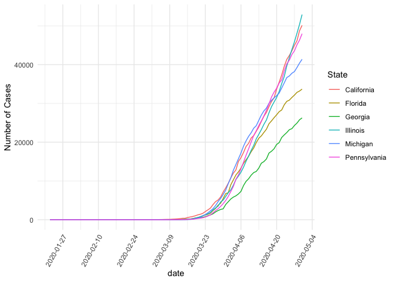

COVID-19 state Reopenings
================

The ultimate goal here it to see if there’s a noticeable impact on
COVID-19 cases as different states start to reopen.

``` r
# Load John Hopkins case data
jhu_latest_raw <- read.csv("https://raw.githubusercontent.com/CSSEGISandData/COVID-19/master/csse_covid_19_data/csse_covid_19_time_series/time_series_covid19_confirmed_US.csv")
```

``` r
# do some data cleaning
jhu_latest <- jhu_latest_raw 
jhu_latest <- jhu_latest %>% filter(iso3 == "USA") %>%
 select(-UID, -iso2, -iso3, -code3, -FIPS, -Admin2, -Country_Region, -Lat, -Long_, -Combined_Key) 

by_state <- jhu_latest %>% 
  group_by(Province_State) %>%
  summarise_all(funs(sum(.))) %>%
  column_to_rownames(var = "Province_State") %>%
  t() %>%
  as.data.frame() %>%
  rownames_to_column() %>%
  mutate(date = str_sub(rowname, 2)) %>%
  select(date, everything()) %>%
  select(-rowname) %>%
  mutate(date = mdy(date))
```

``` r
# plot select states (initially selecting some of the states where people are protesting, will refine with more precise selection)
states = c("Florida", "Georgia", "Michigan", "California", "Illinois", "Pennsylvania")
states <- by_state %>%
  select(date, all_of(states)) %>%
  gather(key = "State", value = "value", -date)


ggplot(states, aes(x = date, y = value)) + 
  geom_line(aes(color = State)) + 
  scale_x_date(date_breaks = "1 week") +
  ylab("Number of Cases") + 
  theme_minimal() + 
  theme(axis.text.x=element_text(angle=60, hjust=1))
```

<!-- -->
Y-axis on a logarithmic scale

``` r
ggplot(states, aes(x = date, y = value)) + 
  geom_line(aes(color = State)) + 
  scale_x_date(date_breaks = "1 weeks") +
  ylab("Number of Cases (logarithmic axis") + 
  xlab("Week") +
  scale_y_continuous(trans = "log2") +
  theme_minimal() + 
  theme(axis.text.x=element_text(angle=60, hjust=1)) 
```

<!-- -->

Last Updated:

    ## [1] "2020-05-02 11:23:06 EDT"

To Do: \* Refresh States
