COVID-19 US State Re-Openings
================

The ultimate goal here it to see if there’s a noticeable impact on
COVID-19 case data as the different states start to reopen.

``` r
# Load John Hopkins USA case data
jhu_latest_raw <- read.csv("https://raw.githubusercontent.com/CSSEGISandData/COVID-19/master/csse_covid_19_data/csse_covid_19_time_series/time_series_covid19_confirmed_US.csv")
```

``` r
# do some data cleaning
jhu_latest <- jhu_latest_raw 
jhu_latest <- jhu_latest %>% filter(iso3 == "USA") %>%
 select(-UID, -iso2, -iso3, -code3, -FIPS, -Admin2, -Country_Region, -Lat, -Long_, -Combined_Key) 

by_state <- jhu_latest %>% 
  group_by(Province_State) %>%
  summarise_all(funs(sum(.))) %>%
  column_to_rownames(var = "Province_State") %>%
  t() %>%
  as.data.frame() %>%
  rownames_to_column() %>%
  mutate(date = str_sub(rowname, 2)) %>%
  select(date, everything()) %>%
  select(-rowname) %>%
  mutate(date = mdy(date)) %>%
  filter(date >="2020-03-01")
```

``` r
# function for plotting state data
plot_state_reopening <- function(state_name, lockdown_date="2022-12-31", reopen_date="2022-12-31") {
  state <- by_state %>% select(date, all_of(state_name)) 
  
  ggplot(state, aes_(x = as.name(names(state)[1]), y = as.name(names(state)[2]))) +
    geom_bar(stat= "identity") +
    scale_x_date(date_breaks = "1 week") +
    ylab("Number of Cases") +
    xlab("Date") +
    scale_y_continuous(labels = comma) +
    geom_vline(xintercept = as.Date(lockdown_date), linetype="dotted",
               color = "blue", size=1) +
    geom_vline(xintercept = as.Date(reopen_date), linetype="dotted",
               color = "red", size=1) +
     #annotate("rect", xmin = as.Date(lockdown_date), xmax = as.Date(reopen_date), ymin = 0, ymax = Inf,
       # alpha = .2) +
    theme_light() +
    labs(title = "COVID-19 Confirmed Cases (Cumulative)", subtitle = state_name) +
    theme(axis.text.x=element_text(angle=60, hjust=1))
  
}
plot_state_reopening_log <- function(state_name, lockdown_date="2022-12-31", reopen_date="2022-12-31") {
  state <- by_state %>% select(date, all_of(state_name)) 
  ggplot(state, aes_(x = as.name(names(state)[1]), y = as.name(names(state)[2]))) + 
    geom_line() +
    scale_x_date(date_breaks = "1 weeks") +
    ylab("Number of Cases (logarithmic scale)") +
    xlab("Week") +
    scale_y_continuous(trans = "log2") +
    geom_vline(xintercept = as.Date(lockdown_date), linetype="dotted",
               color = "blue", size=1) +
    geom_vline(xintercept = as.Date(reopen_date), linetype="dotted",
               color = "red", size=1) +
      theme_bw() +
      theme(axis.text.x=element_text(angle=60, hjust=1))

}
```

The blue vertical line is when the state first went into lockdown while
the red vertical line is the date the state started to reopen

## Alabama

``` r
# call the state_reopen function for individual states
plot_state_reopening("Alabama","2020-04-04", "2020-04-30")
```

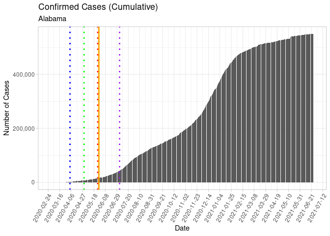<!-- -->

``` r
plot_state_reopening_log("Alabama","2020-04-04", "2020-04-30")
```

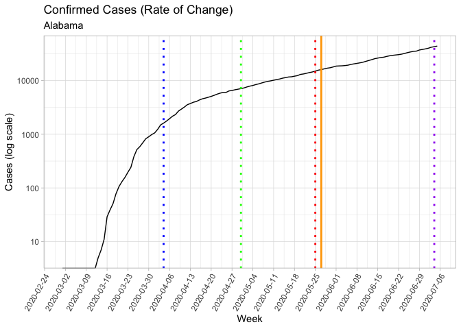<!-- -->

## Alaska

``` r
# call the state_reopen function for individual states
plot_state_reopening("Alaska","2020-03-28", "2020-04-24")
```

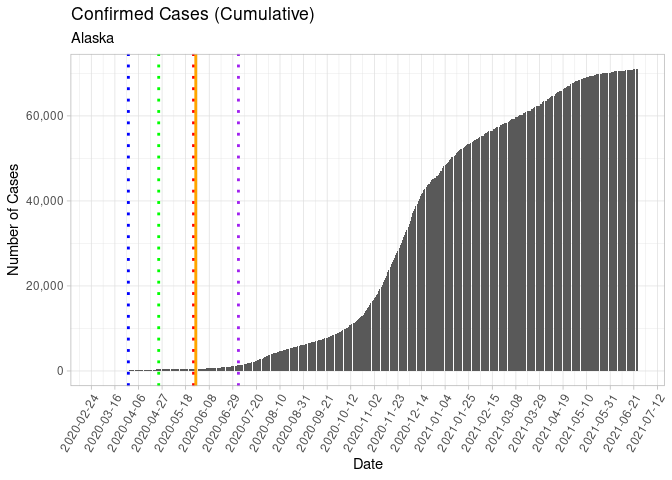<!-- -->

``` r
plot_state_reopening_log("Alaska","2020-03-28", "2020-04-24")
```

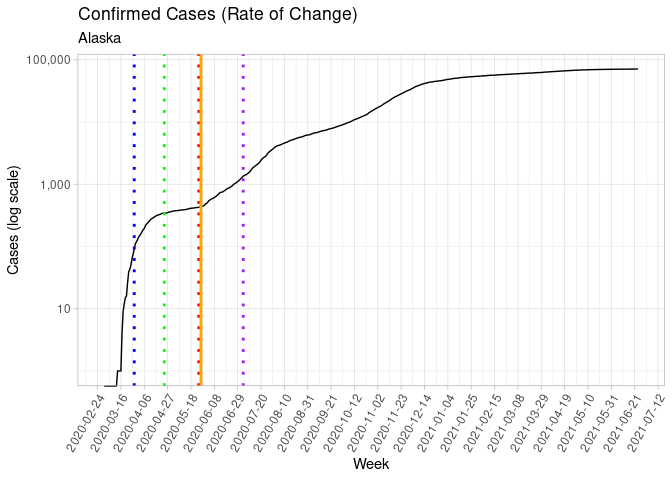<!-- -->

## Arizona

``` r
# call the state_reopen function for individual states
plot_state_reopening("Arizona","2020-03-31", "2020-05-15")
```

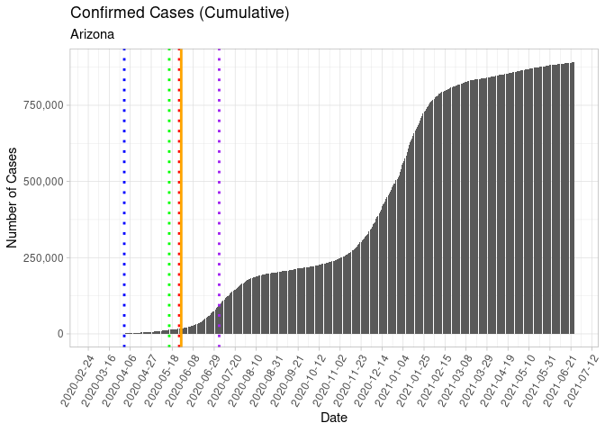<!-- -->

``` r
plot_state_reopening_log("Arizona","2020-03-31", "2020-05-15")
```

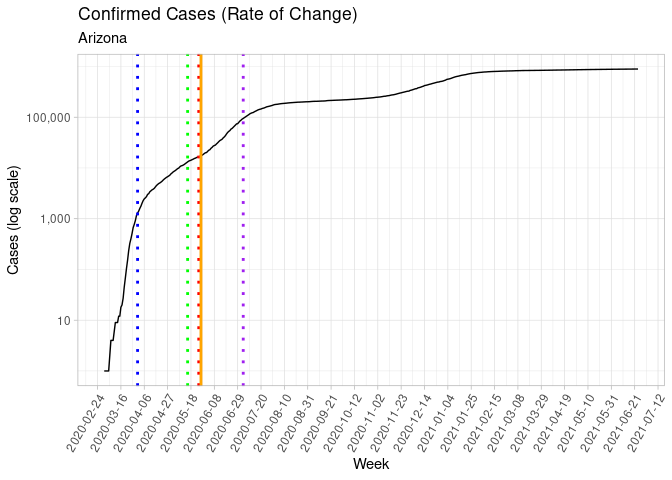<!-- -->

## Arkansas

``` r
# call the state_reopen function for individual states
plot_state_reopening("Arkansas", , "2020-05-06")
```

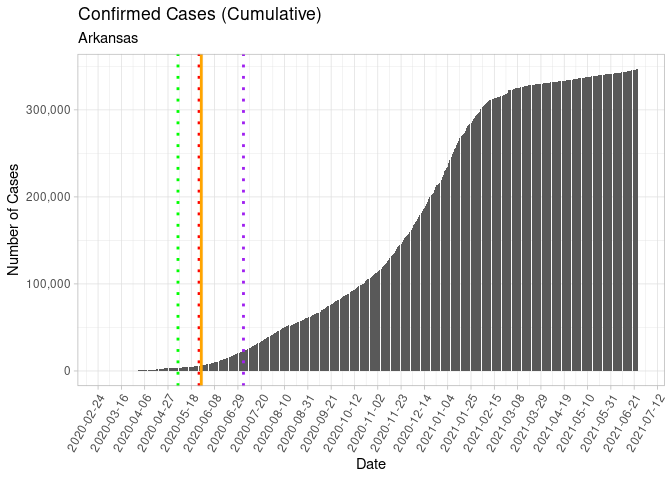<!-- -->

``` r
plot_state_reopening_log("Arkansas", , "2020-05-06")
```

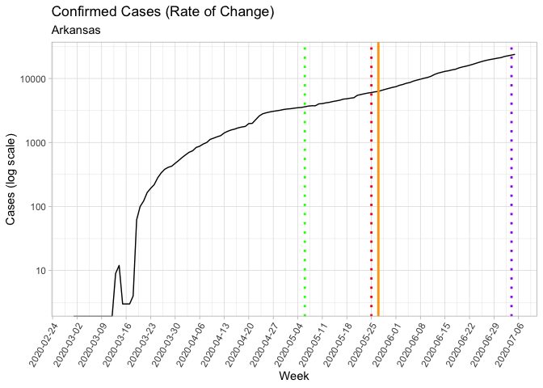<!-- -->

## California

``` r
# call the state_reopen function for individual states
plot_state_reopening("California","2020-03-19", )
```

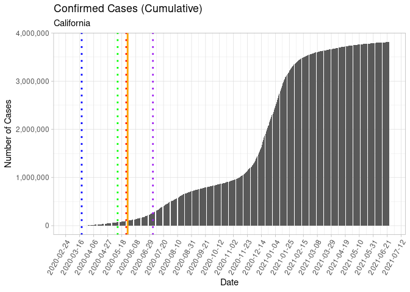<!-- -->

``` r
plot_state_reopening_log("California", "2020-03-19", )
```

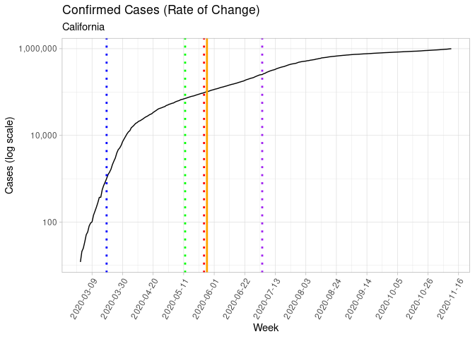<!-- -->

## Colorado

``` r
# call the state_reopen function for individual states
plot_state_reopening("Colorado","2020-03-26", "2020-04-26")
```

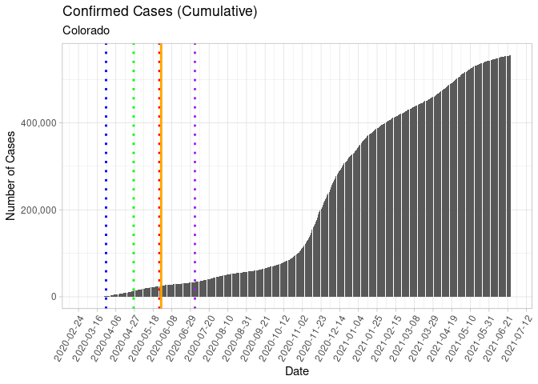<!-- -->

``` r
plot_state_reopening_log("Colorado", "2020-03-26", "2020-04-26")
```

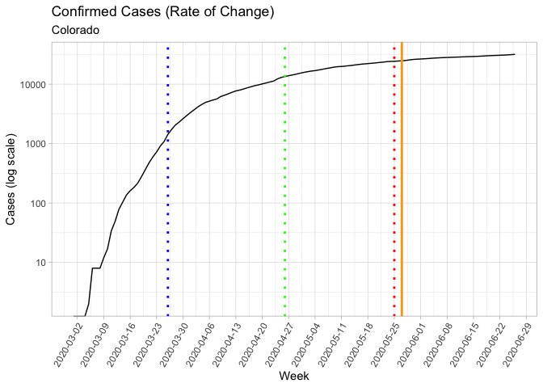<!-- -->

## Connecticut

``` r
# call the state_reopen function for individual states
plot_state_reopening("Connecticut","2020-03-23", )
```

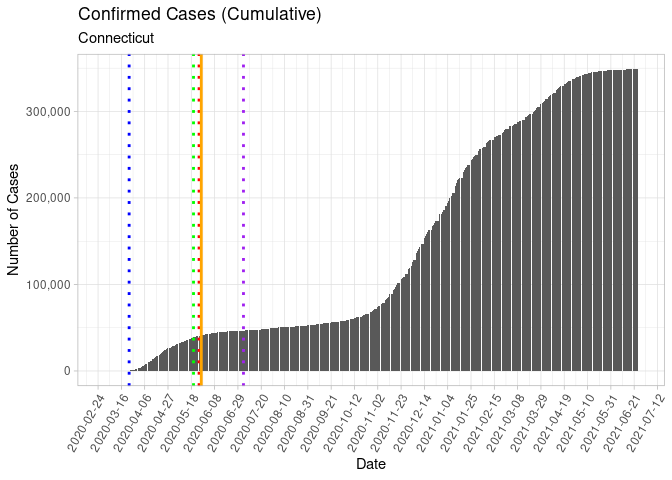<!-- -->

``` r
plot_state_reopening_log("Connecticut", "2020-03-23", )
```

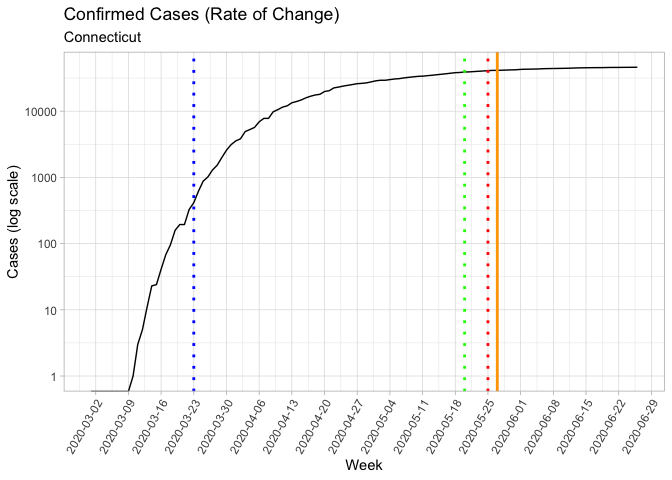<!-- -->

## Delaware

``` r
# call the state_reopen function for individual states
plot_state_reopening("Delaware","2020-03-24", )
```

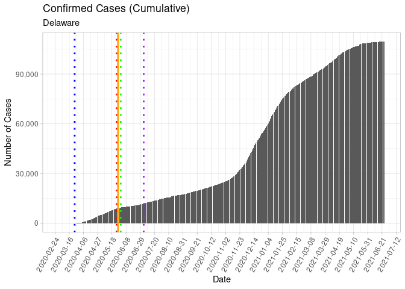<!-- -->

``` r
plot_state_reopening_log("Delaware", "2020-03-24", )
```

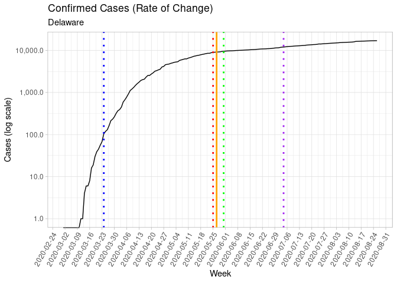<!-- -->

## District of Columbia

``` r
# call the state_reopen function for individual states
plot_state_reopening("District of Columbia","2020-04-01", )
```

<!-- -->

``` r
plot_state_reopening_log("District of Columbia", "2020-04-01", )
```

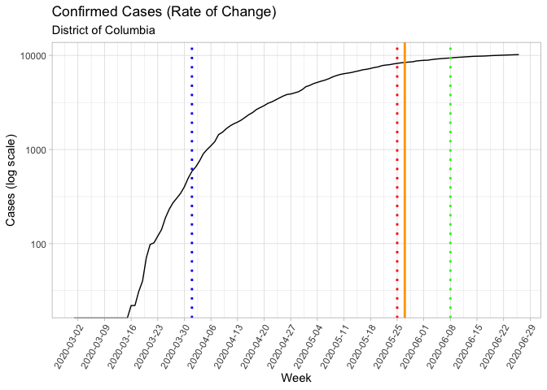<!-- -->

## Florida

``` r
# call the state_reopen function for individual states
plot_state_reopening("Florida","2020-04-03", )
```

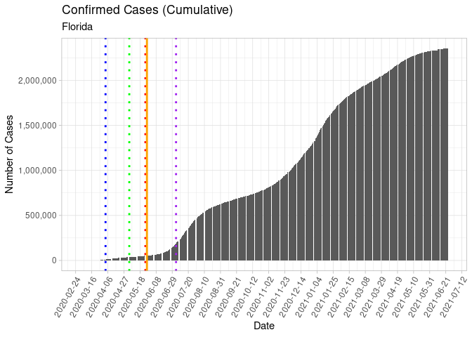<!-- -->

``` r
plot_state_reopening_log("Florida", "2020-04-03", )
```

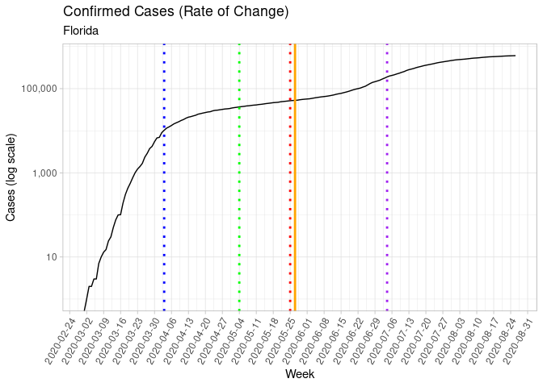<!-- -->

## Georgia

``` r
# call the state_reopen function for individual states
plot_state_reopening("Georgia","2020-04-03", "2020-04-24")
```

<!-- -->

``` r
plot_state_reopening_log("Georgia", "2020-04-03", "2020-04-24")
```

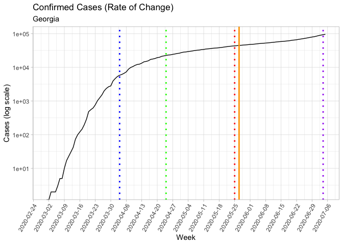<!-- -->

## Hawaii

``` r
# call the state_reopen function for individual states
plot_state_reopening("Hawaii","2020-03-25", "2020-05-07")
```

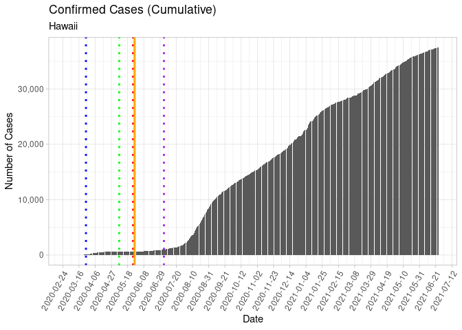<!-- -->

``` r
plot_state_reopening_log("Hawaii", "2020-03-25", "2020-05-07")
```

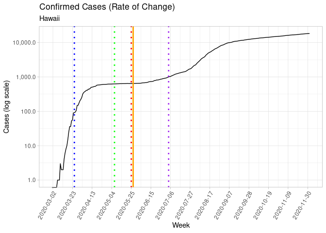<!-- -->

## Idaho

``` r
# call the state_reopen function for individual states
plot_state_reopening("Idaho","2020-03-25", "2020-04-30")
```

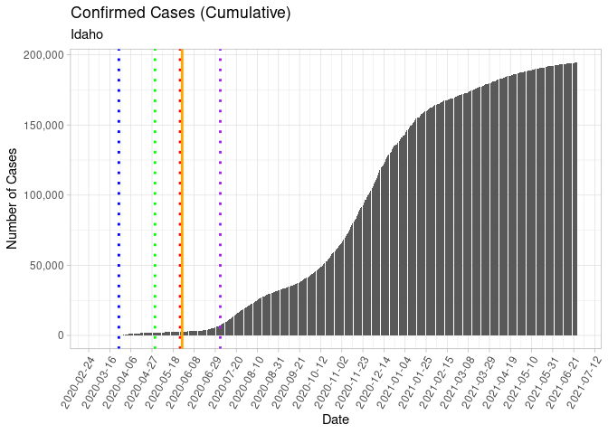<!-- -->

``` r
plot_state_reopening_log("Idaho", "2020-03-25", "2020-04-30")
```

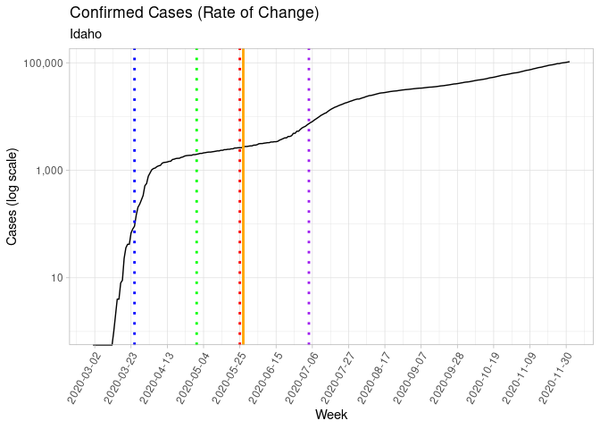<!-- -->

## Illinois

``` r
# call the state_reopen function for individual states
plot_state_reopening("Illinois","2020-03-21", )
```

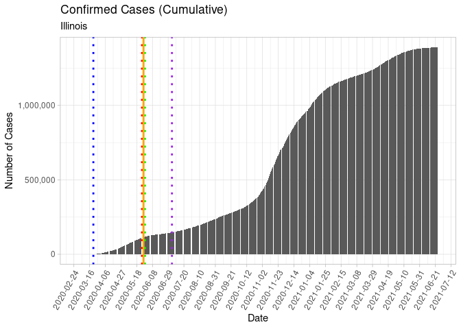<!-- -->

``` r
plot_state_reopening_log("Illinois", "2020-03-21", )
```

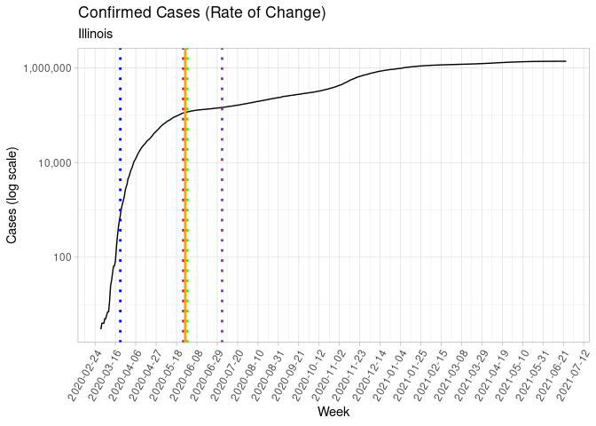<!-- -->

## Indiana

``` r
# call the state_reopen function for individual states
plot_state_reopening("Indiana","2020-03-24", "2020-05-04")
```

<!-- -->

``` r
plot_state_reopening_log("Indiana", "2020-03-24", "2020-05-04")
```

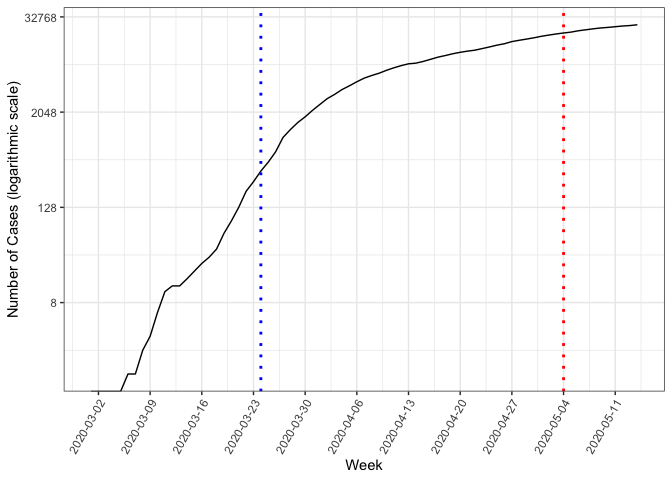<!-- -->

## Iowa

``` r
# call the state_reopen function for individual states
plot_state_reopening("Iowa", , "2020-05-01")
```

<!-- -->

``` r
plot_state_reopening_log("Iowa", , "2020-05-01")
```

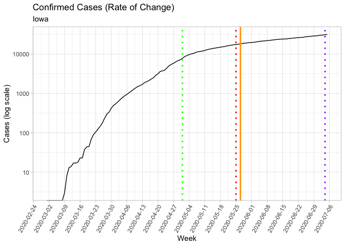<!-- -->

## Kansas

``` r
# call the state_reopen function for individual states
plot_state_reopening("Kansas","2020-03-30", "2020-05-04")
```

<!-- -->

``` r
plot_state_reopening_log("Kansas", "2020-03-30", "2020-05-04")
```

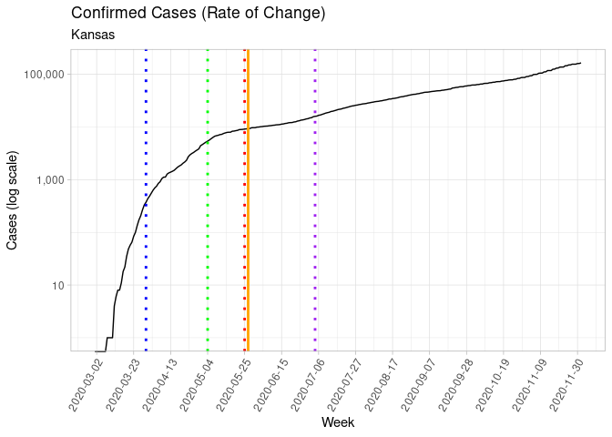<!-- -->

## Kentucky

``` r
# call the state_reopen function for individual states
plot_state_reopening("Kentucky","2020-03-26", )
```

<!-- -->

``` r
plot_state_reopening_log("Kentucky", "2020-03-26", )
```

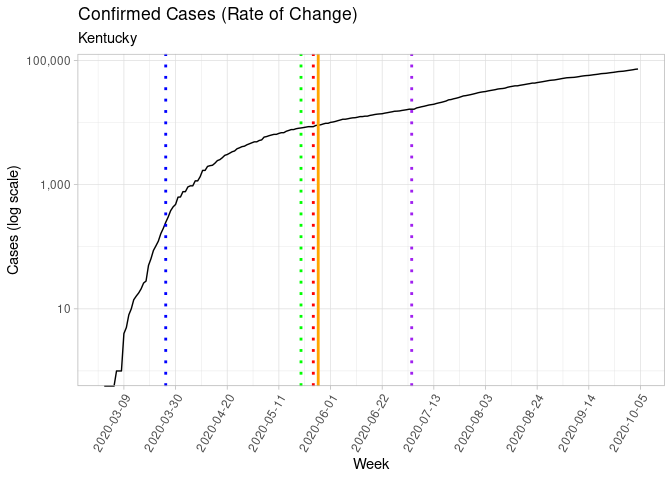<!-- -->

## Louisiana

``` r
# call the state_reopen function for individual states
plot_state_reopening("Louisiana","2020-03-23", "2020-05-15")
```

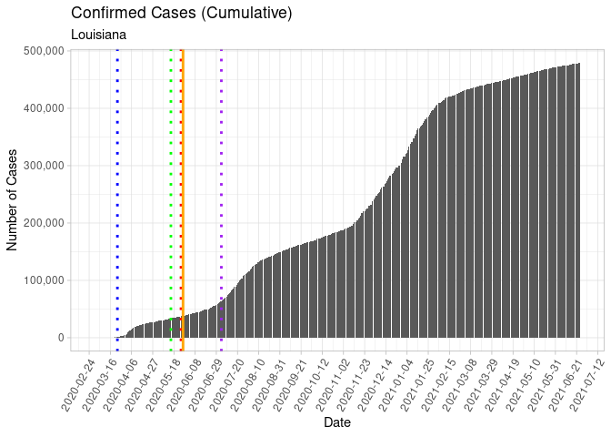<!-- -->

``` r
plot_state_reopening_log("Louisiana", "2020-03-23", "2020-05-15")
```

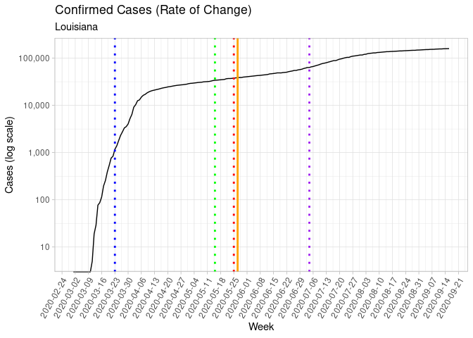<!-- -->

## Maine

``` r
# call the state_reopen function for individual states
plot_state_reopening("Maine","2020-04-02", "2020-05-31")
```

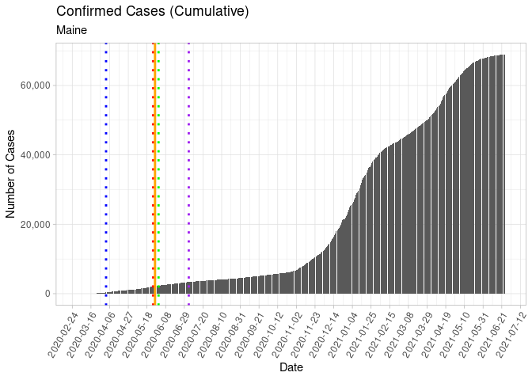<!-- -->

``` r
plot_state_reopening_log("Maine", "2020-04-02", "2020-05-31")
```

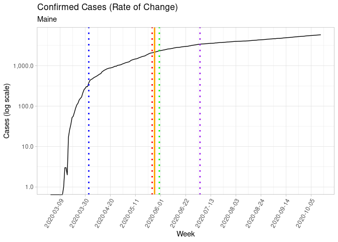<!-- -->

## Maryland

``` r
# call the state_reopen function for individual states
plot_state_reopening("Maryland","2020-03-30", "2020-05-15")
```

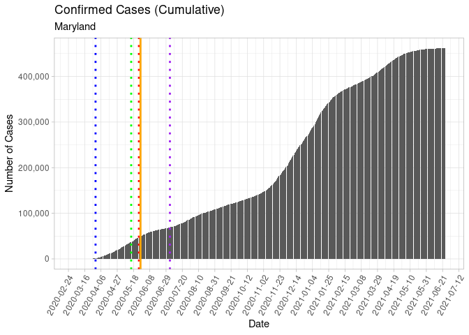<!-- -->

``` r
plot_state_reopening_log("Maryland", "2020-03-30", "2020-05-15")
```

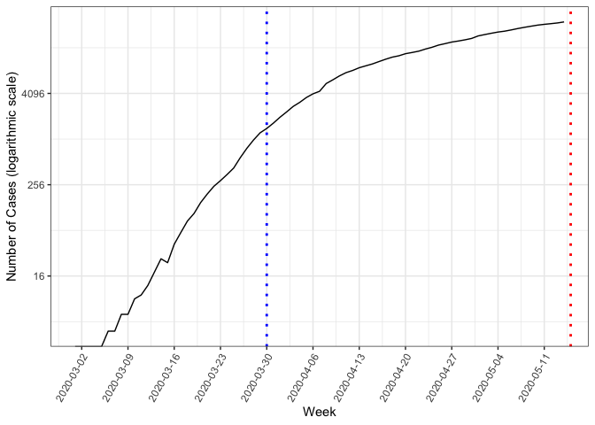<!-- -->

## Massachusetts

``` r
# call the state_reopen function for individual states
plot_state_reopening("Massachusetts","2020-03-24", )
```

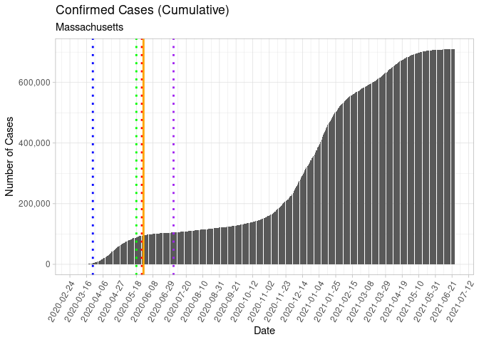<!-- -->

``` r
plot_state_reopening_log("Massachusetts", "2020-03-24", )
```

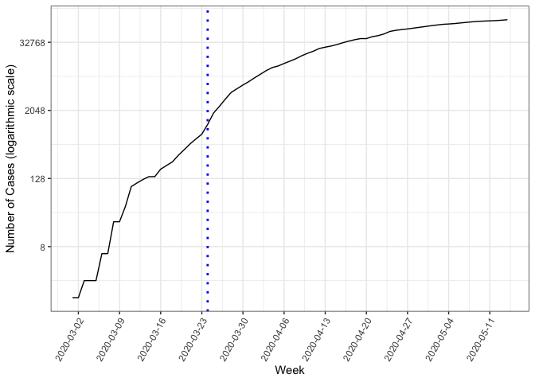<!-- -->

## Michigan

``` r
# call the state_reopen function for individual states
plot_state_reopening("Michigan","2020-03-24", )
```

<!-- -->

``` r
plot_state_reopening_log("Michigan", "2020-03-24", )
```

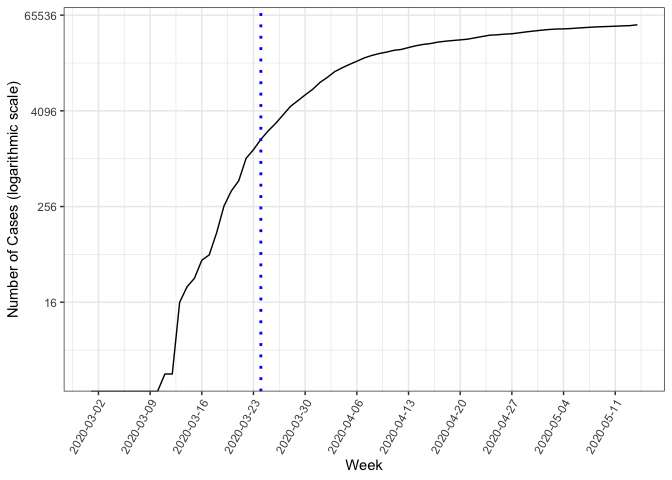<!-- -->

## Minnesota

``` r
# call the state_reopen function for individual states
plot_state_reopening("Minnesota","2020-03-27",  )
```

<!-- -->

``` r
plot_state_reopening_log("Minnesota", "2020-03-27", )
```

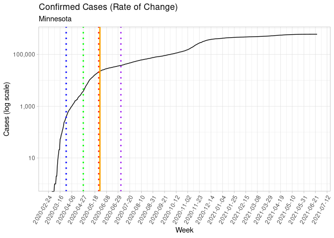<!-- -->

## Mississippi

``` r
# call the state_reopen function for individual states
plot_state_reopening("Mississippi","2020-04-03", "2020-04-27")
```

<!-- -->

``` r
plot_state_reopening_log("Mississippi", "2020-04-03", "2020-04-27")
```

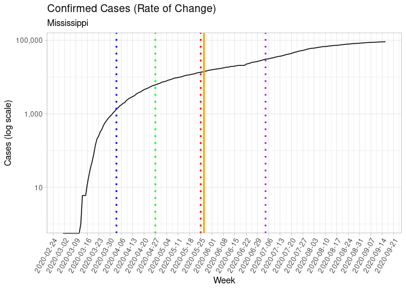<!-- -->

## Missouri

``` r
# call the state_reopen function for individual states
plot_state_reopening("Missouri","2020-04-06", "2020-05-03")
```

<!-- -->

``` r
plot_state_reopening_log("Missouri", "2020-04-06", "2020-05-03")
```

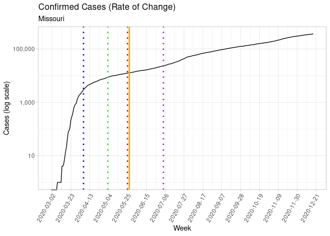<!-- -->

## Montana

``` r
# call the state_reopen function for individual states
plot_state_reopening("Montana","2020-03-28", "2020-04-26")
```

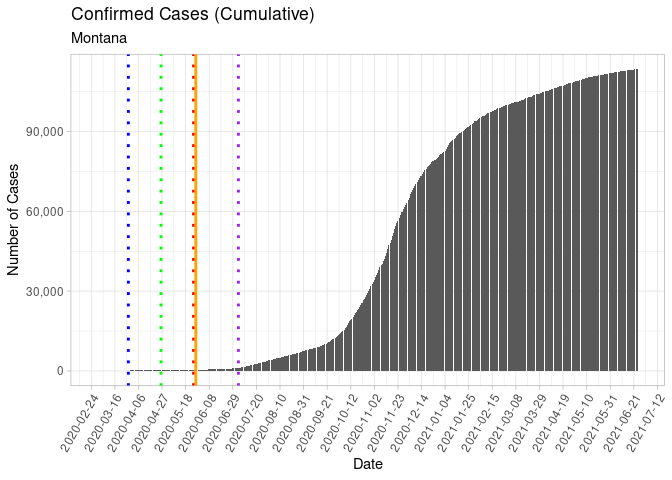<!-- -->

``` r
plot_state_reopening_log("Montana", "2020-03-28", "2020-04-26")
```

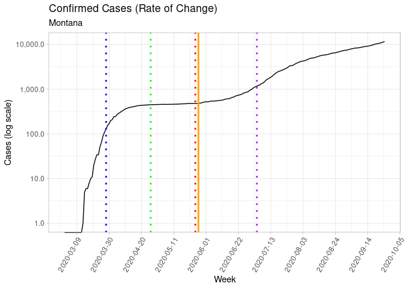<!-- -->

## Nebraska

``` r
# call the state_reopen function for individual states
plot_state_reopening("Nebraska", , )
```

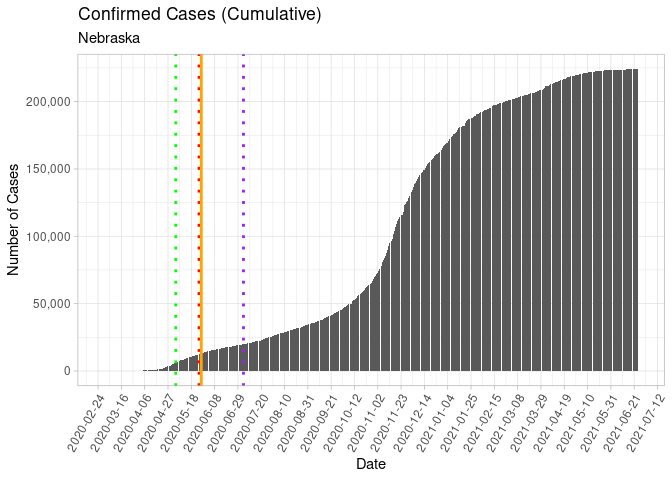<!-- -->

``` r
plot_state_reopening_log("Nebraska", , )
```

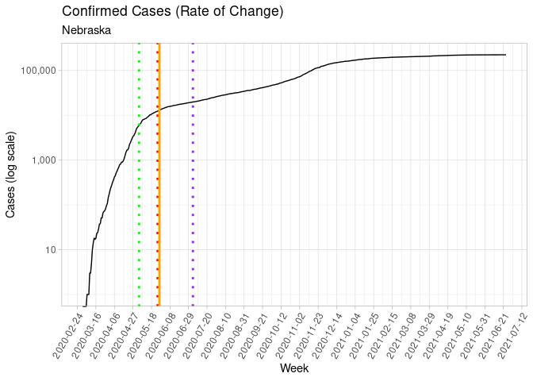<!-- -->

## Nevada

``` r
# call the state_reopen function for individual states
plot_state_reopening("Nevada","2020-04-01", "2020-05-09")
```

<!-- -->

``` r
plot_state_reopening_log("Nevada", "2020-04-01", "2020-05-09")
```

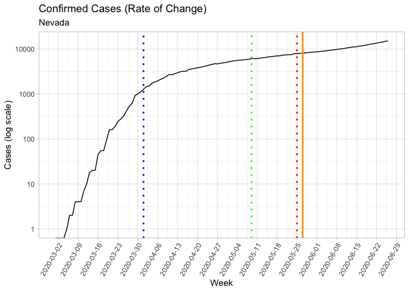<!-- -->

## New Hampshire

``` r
# call the state_reopen function for individual states
plot_state_reopening("New Hampshire","2020-03-27", "2020-05-31")
```

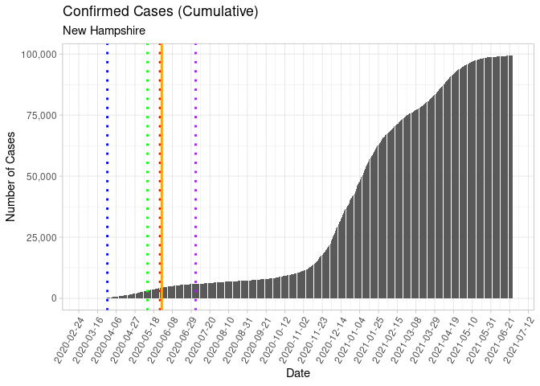<!-- -->

``` r
plot_state_reopening_log("New Hampshire", "2020-03-27", "2020-05-31")
```

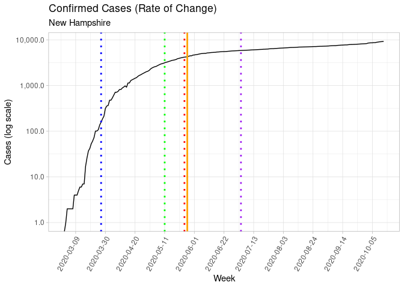<!-- -->

## New Jersey

``` r
# call the state_reopen function for individual states
plot_state_reopening("New Jersey","2020-03-21", )
```

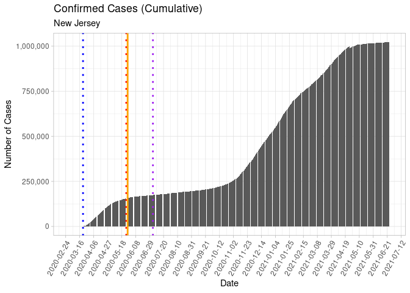<!-- -->

``` r
plot_state_reopening_log("New Jersey", "2020-03-21", )
```

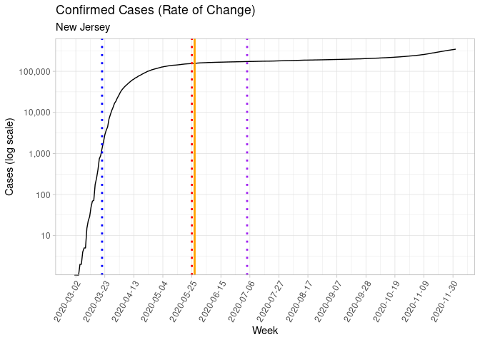<!-- -->

## New Mexico

``` r
# call the state_reopen function for individual states
plot_state_reopening("New Mexico","2020-03-24", )
```

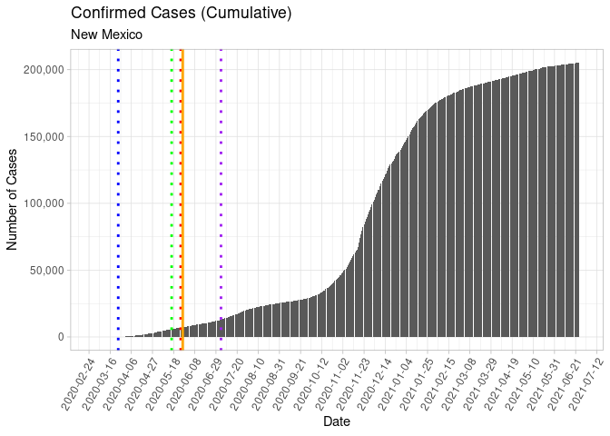<!-- -->

``` r
plot_state_reopening_log("New Mexico", "2020-03-24", )
```

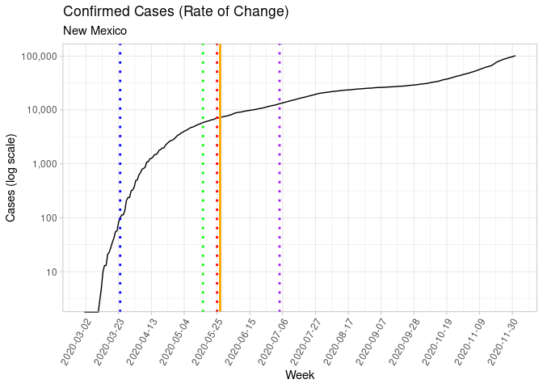<!-- -->

## New York

``` r
# call the state_reopen function for individual states
plot_state_reopening("New York","2020-03-22", )
```

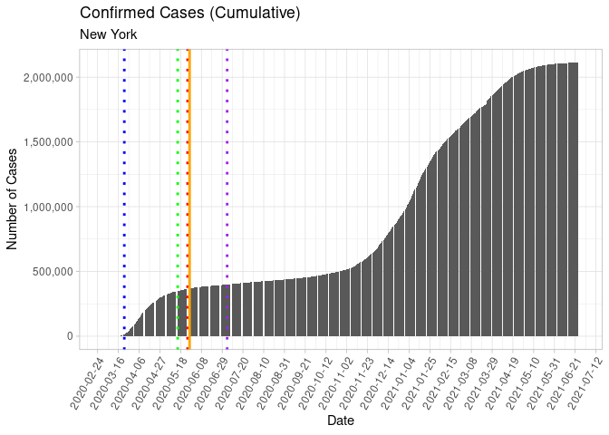<!-- -->

``` r
plot_state_reopening_log("New York", "2020-03-22", )
```

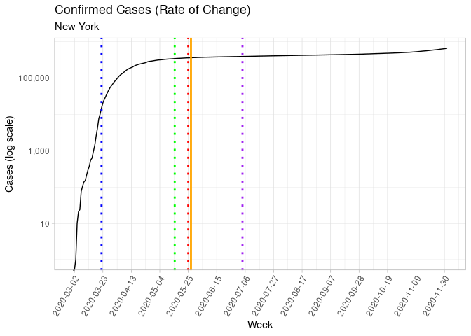<!-- -->

## North Carolina

``` r
# call the state_reopen function for individual states
plot_state_reopening("North Carolina","2020-03-30", "2020-05-22")
```

<!-- -->

``` r
plot_state_reopening_log("North Carolina", "2020-03-30", "2020-05-22")
```

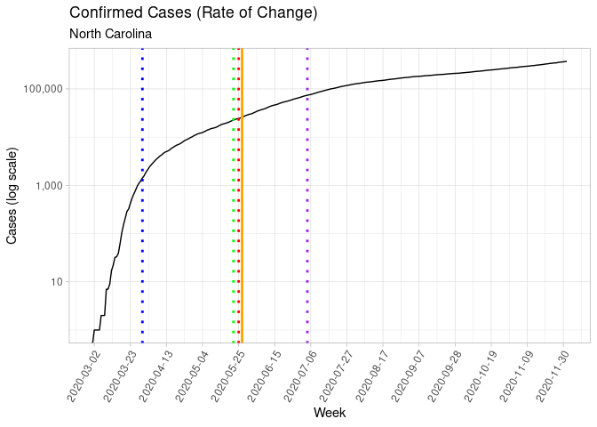<!-- -->

## North Dakota

``` r
# call the state_reopen function for individual states
plot_state_reopening("North Dakota", , "2020-05-01")
```

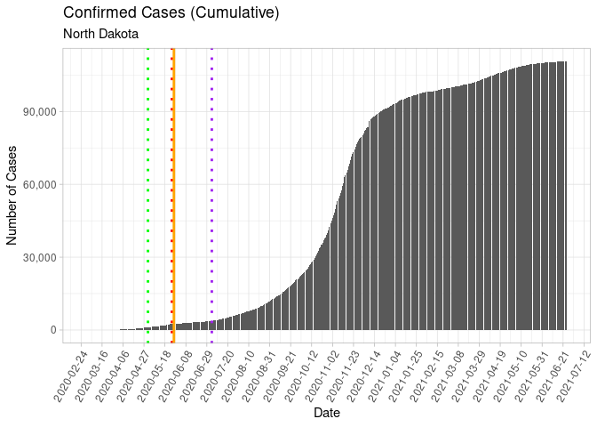<!-- -->

``` r
plot_state_reopening_log("North Dakota", , "2020-05-01")
```

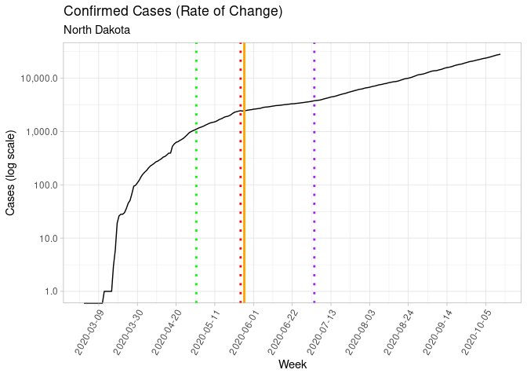<!-- -->

## Ohio

``` r
# call the state_reopen function for individual states
plot_state_reopening("Ohio","2020-03-23", "2020-05-29")
```

<!-- -->

``` r
plot_state_reopening_log("Ohio", "2020-03-23", "2020-05-29")
```

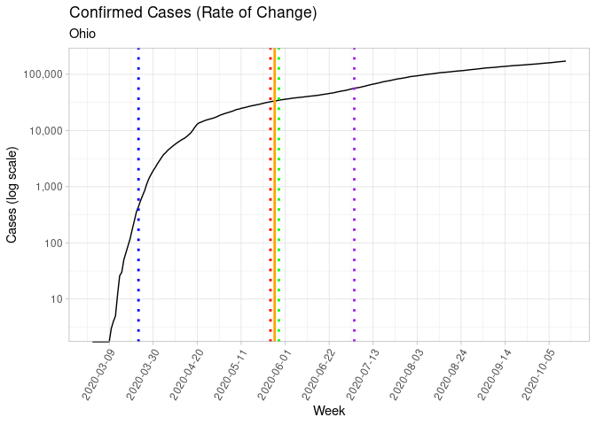<!-- -->

## Oklahoma

``` r
# call the state_reopen function for individual states
plot_state_reopening("Oklahoma","2020-04-06", "2020-04-24")
```

<!-- -->

``` r
plot_state_reopening_log("Oklahoma", "2020-04-06", "2020-04-24")
```

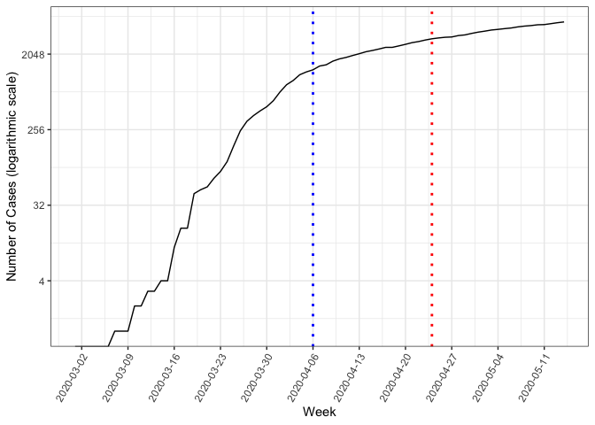<!-- -->

## Oregon

``` r
# call the state_reopen function for individual states
plot_state_reopening("Oregon","2020-03-23", "2020-05-15")
```

<!-- -->

``` r
plot_state_reopening_log("Oregon", "2020-03-23", "2020-05-15")
```

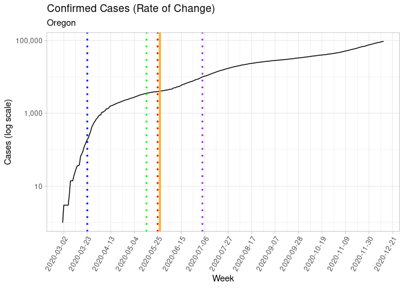<!-- -->

## Pennsylvania

``` r
# call the state_reopen function for individual states
plot_state_reopening("Pennsylvania","2020-04-01", )
```

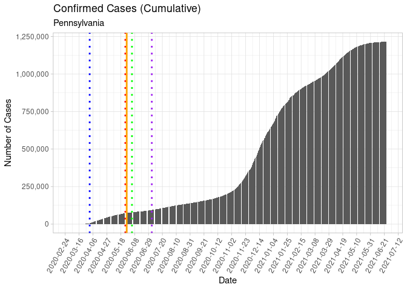<!-- -->

``` r
plot_state_reopening_log("Pennsylvania", "2020-04-01", )
```

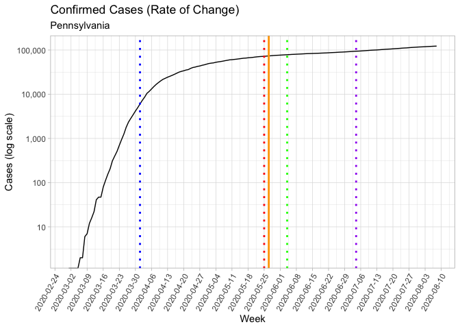<!-- -->

## Rhode Island

``` r
# call the state_reopen function for individual states
plot_state_reopening("Rhode Island","2020-03-28", "2020-05-08")
```

<!-- -->

``` r
plot_state_reopening_log("Rhode Island", "2020-03-28", "2020-05-08")
```

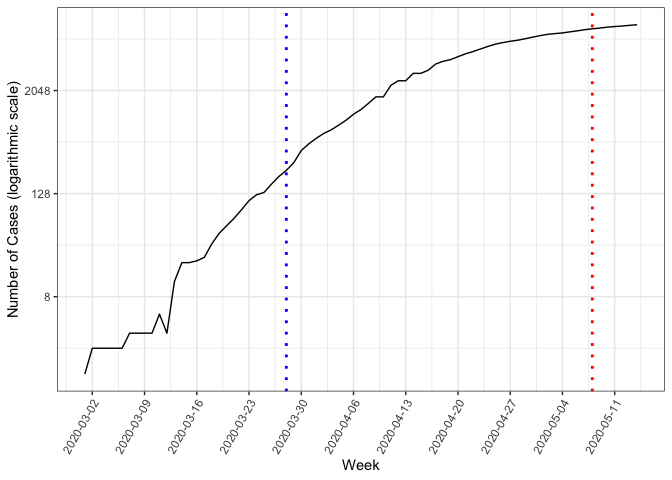<!-- -->

## South Carolina

``` r
# call the state_reopen function for individual states
plot_state_reopening("South Carolina","2020-04-07", "2020-05-04")
```

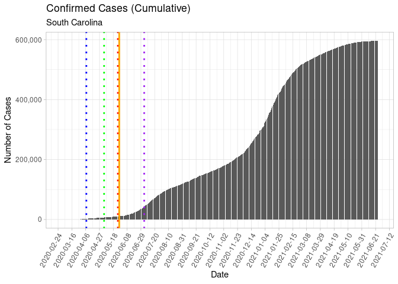<!-- -->

``` r
plot_state_reopening_log("South Carolina", "2020-04-07", "2020-05-04")
```

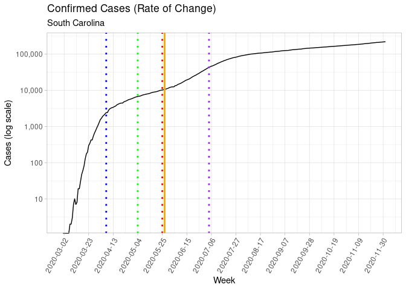<!-- -->

## South Dakota

``` r
# call the state_reopen function for individual states
plot_state_reopening("South Dakota",, )
```

<!-- -->

``` r
plot_state_reopening_log("South Dakota", , )
```

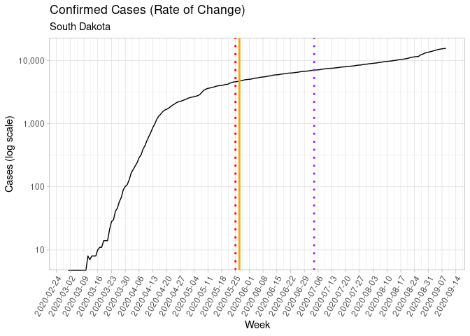<!-- -->

## Tennessee

``` r
# call the state_reopen function for individual states
plot_state_reopening("Tennessee","2020-03-31", )
```

<!-- -->

``` r
plot_state_reopening_log("Tennessee", "2020-03-31", )
```

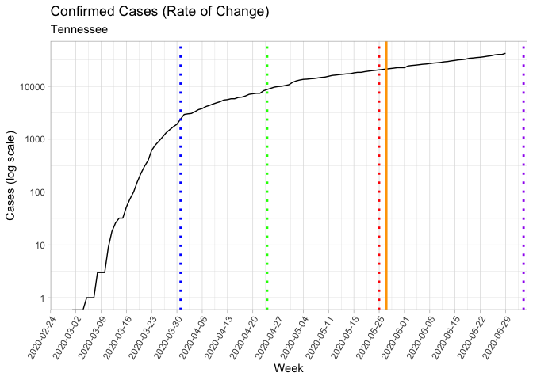<!-- -->

## Texas

``` r
# call the state_reopen function for individual states
plot_state_reopening("Texas","2020-04-02", "2020-04-30")
```

<!-- -->

``` r
plot_state_reopening_log("Texas", "2020-04-02", "2020-04-30")
```

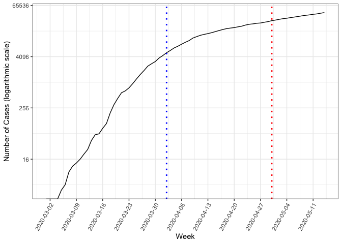<!-- -->

## Utah

``` r
# call the state_reopen function for individual states
plot_state_reopening("Utah","2020-04-01", "2020-05-01")
```

<!-- -->

``` r
plot_state_reopening_log("Utah", "2020-04-01", "2020-05-01")
```

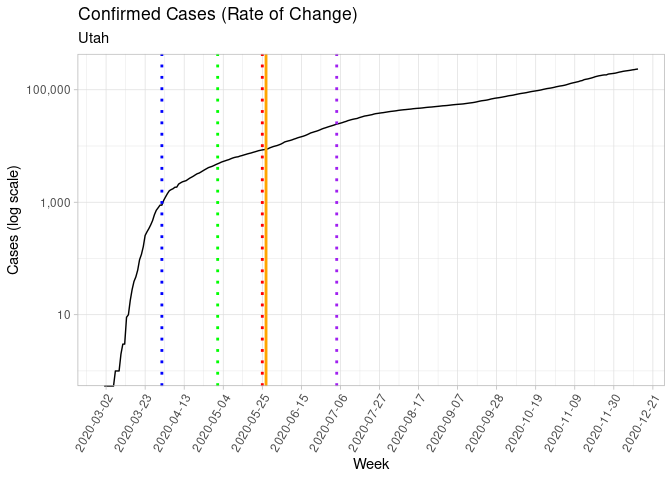<!-- -->

## Vermont

``` r
# call the state_reopen function for individual states
plot_state_reopening("Vermont","2020-03-25", )
```

<!-- -->

``` r
plot_state_reopening_log("Vermont", "2020-03-25", )
```

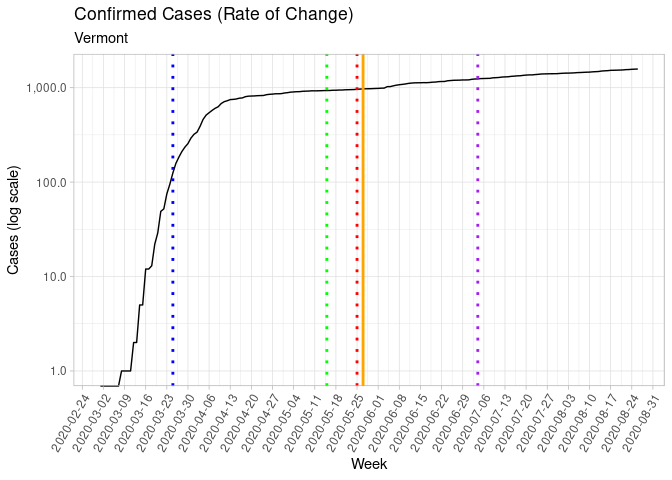<!-- -->

## Virginia

``` r
# call the state_reopen function for individual states
plot_state_reopening("Virginia","2020-03-30", )
```

<!-- -->

``` r
plot_state_reopening_log("Virginia", "2020-03-30", )
```

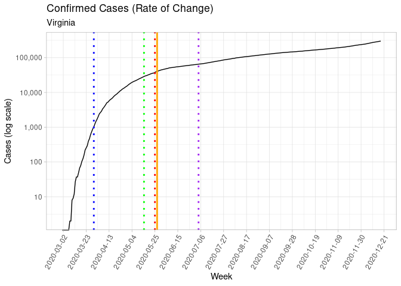<!-- -->

## Washington

``` r
# call the state_reopen function for individual states
plot_state_reopening("Washington","2020-03-23", )
```

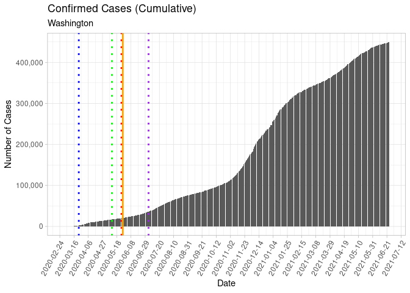<!-- -->

``` r
plot_state_reopening_log("Washington", "2020-03-23", )
```

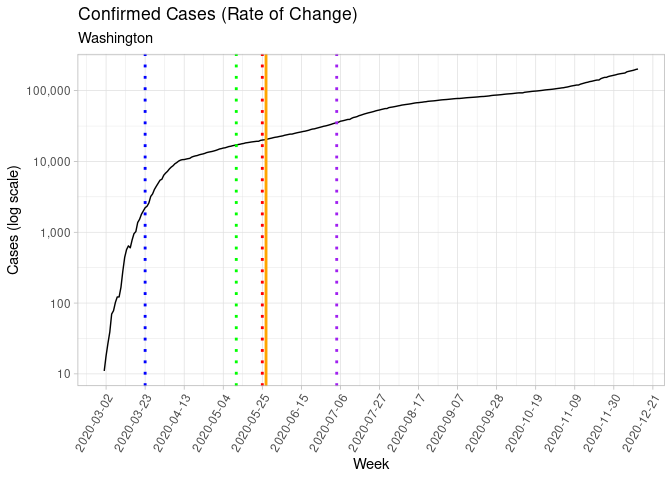<!-- -->

## West Virginia

``` r
# call the state_reopen function for individual states
plot_state_reopening("West Virginia","2020-03-24", "2020-05-04")
```

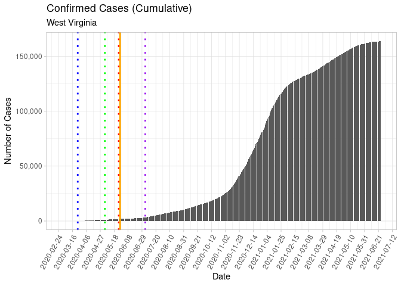<!-- -->

``` r
plot_state_reopening_log("West Virginia", "2020-03-24", "2020-05-04")
```

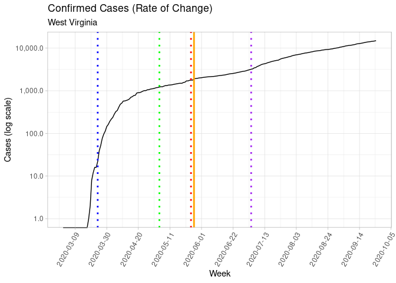<!-- -->

## Wisconsin

``` r
# call the state_reopen function for individual states
plot_state_reopening("Wisconsin","2020-03-25", "2020-05-13")
```

<!-- -->

``` r
plot_state_reopening_log("Wisconsin", "2020-03-25", "2020-05-13")
```

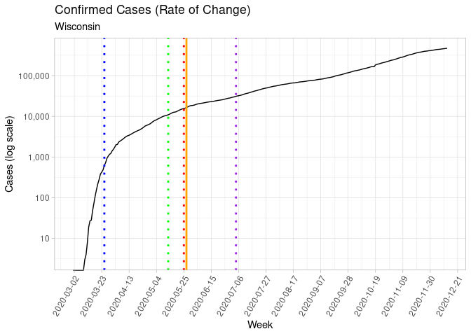<!-- -->

NOTE: Wisconsin stay-at-home order struck down on May 13.

## Wyoming

``` r
# call the state_reopen function for individual states
plot_state_reopening("Wyoming","2020-03-28", "2020-05-01")
```

<!-- -->

``` r
plot_state_reopening_log("Wyoming", "2020-03-28", "2020-05-01")
```

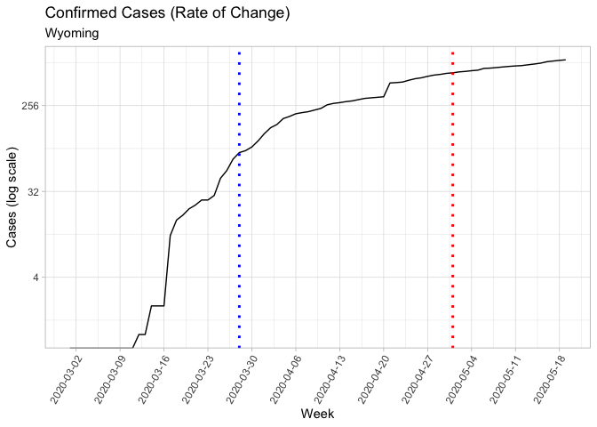<!-- -->

<!-- ```{r} -->

<!-- # plot select states (initially selecting some of the states where people are protesting, will refine with more precise selection) -->

<!-- states = c("Florida", "Georgia", "Michigan", "California", "Illinois", "Pennsylvania", "Colorado") -->

<!-- states <- by_state %>% -->

<!--   select(date, all_of(states)) %>% -->

<!--   gather(key = "State", value = "value", -date) -->

<!-- ggplot(states, aes(x = date, y = value)) +  -->

<!--   geom_line(stat= "identity", aes(color = State)) +  -->

<!--   scale_x_date(date_breaks = "1 week") + -->

<!--   ylab("Number of Cases") +  -->

<!--   scale_y_continuous(labels = comma) + -->

<!--   geom_vline(xintercept = as.Date("2020-05-04"), linetype="dotted",  -->

<!--                 color = "blue", size=1.5) + -->

<!--   theme_minimal() +  -->

<!--   theme(axis.text.x=element_text(angle=60, hjust=1))  -->

<!-- #+ facet_wrap(~State) -->

<!-- ``` -->

Last Updated:

    ## [1] "2020-05-15 22:50:41 EDT"

## REFERENCES

  - <a href="https://www.nytimes.com/interactive/2020/us/coronavirus-stay-at-home-order.html">NY
    Times: See Which States and Cities Have Told Residents to Stay at
    Home</a>
  - <a href="https://www.nytimes.com/interactive/2020/us/states-reopen-map-coronavirus.html">See
    Which States Are Reopening and Which Are Still Shut Down</a>

<a href="https://github.com/marymlucas">My Github</a>

### To Do:

  - Refresh data
  - Add population info
