COVID-19 US State Re-Openings
================

The ultimate goal here it to see if there’s a noticeable impact on
COVID-19 case data as the different states start to reopen.

``` r
# Load John Hopkins USA case data
jhu_latest_raw <- read.csv("https://raw.githubusercontent.com/CSSEGISandData/COVID-19/master/csse_covid_19_data/csse_covid_19_time_series/time_series_covid19_confirmed_US.csv")
jhu_latest_deaths_raw <- read.csv("https://raw.githubusercontent.com/CSSEGISandData/COVID-19/master/csse_covid_19_data/csse_covid_19_time_series/time_series_covid19_deaths_US.csv")
```

``` r
# do some data cleaning
jhu_latest <- jhu_latest_raw 
jhu_latest_deaths <- jhu_latest_deaths_raw
jhu_latest <- jhu_latest %>% filter(iso3 == "USA") %>%
 select(-UID, -iso2, -iso3, -code3, -FIPS, -Admin2, -Country_Region, -Lat, -Long_, -Combined_Key) 
jhu_latest_deaths <- jhu_latest_deaths %>% filter(iso3 == "USA") %>%
 select(-UID, -iso2, -iso3, -code3, -FIPS, -Admin2, -Country_Region, -Lat, -Long_, -Combined_Key)

by_state <- jhu_latest %>% 
  group_by(Province_State) %>%
  summarise_all(funs(sum(.))) %>%
  column_to_rownames(var = "Province_State") %>%
  t() %>%
  as.data.frame() %>%
  rownames_to_column() %>%
  mutate(date = str_sub(rowname, 2)) %>%
  select(date, everything()) %>%
  select(-rowname) %>%
  mutate(date = mdy(date)) %>%
  filter(date >="2020-03-01")

by_state_deaths <- jhu_latest_deaths %>% 
  group_by(Province_State) %>%
  summarise_all(funs(sum(.))) %>%
  column_to_rownames(var = "Province_State") %>%
  t() %>%
  as.data.frame() %>%
  rownames_to_column() %>%
  mutate(date = str_sub(rowname, 2)) %>%
  select(date, everything()) %>%
  select(-rowname) %>%
  mutate(date = mdy(date)) %>%
  filter(date >="2020-03-01")
```

``` r
# Some US states did not declare an official start date and/or end date of lockdown, and therefore we set default dates for these that are far in the future to prevent them from plotting.
# function for plotting state data
plot_state_reopening <- function(state_name, lockdown_date="2100-12-31", reopen_date="2100-12-31", memorial_day = "2020-05-25", george_floyd_protests_start = "2020-05-27") {
  state <- by_state %>% select(date, all_of(state_name)) 
  
  ggplot(state, aes_(x = as.name(names(state)[1]), y = as.name(names(state)[2]))) +
    geom_bar(stat= "identity") +
    scale_x_date(date_breaks = "1 week") +
    ylab("Number of Cases") +
    xlab("Date") +
    scale_y_continuous(labels = comma) +
    geom_vline(xintercept = as.Date(lockdown_date), linetype="dotted",
               color = "blue", size=1) +
    geom_vline(xintercept = as.Date(reopen_date), linetype="dotted",
               color = "green", size=1) +
    geom_vline(xintercept = as.Date(memorial_day), linetype="dotted",
               color = "red", size=1) +
    geom_vline(xintercept = as.Date(george_floyd_protests_start), linetype="solid",
               color = "orange", size=1) +
     #annotate("rect", xmin = as.Date(lockdown_date), xmax = as.Date(reopen_date), ymin = 0, ymax = Inf,
       # alpha = .2) +
    theme_light() +
    labs(title = "Confirmed Cases (Cumulative)", subtitle = state_name) +
    theme(axis.text.x=element_text(angle=60, hjust=1))
  
}
plot_state_reopening_log <- function(state_name, lockdown_date="2100-12-31", reopen_date="2100-12-31", memorial_day = "2020-05-25", george_floyd_protests_start = "2020-05-27") {
  state <- by_state %>% select(date, all_of(state_name)) 
  ggplot(state, aes_(x = as.name(names(state)[1]), y = as.name(names(state)[2]))) + 
    geom_line() +
    scale_x_date(date_breaks = "1 weeks") +
    ylab("Cases (log scale)") +
    xlab("Week") +
    scale_y_continuous(trans = "log10") +
    geom_vline(xintercept = as.Date(lockdown_date), linetype="dotted",
               color = "blue", size=1) +
    geom_vline(xintercept = as.Date(reopen_date), linetype="dotted",
               color = "green", size=1) +
    geom_vline(xintercept = as.Date(memorial_day), linetype="dotted",
               color = "red", size=1) +
    geom_vline(xintercept = as.Date(george_floyd_protests_start), linetype="solid",
               color = "orange", size=1) +
     
      theme_light() +
    labs(title = "Confirmed Cases (Rate of Change)", subtitle = state_name) +
      theme(axis.text.x=element_text(angle=60, hjust=1))

}

# deaths
plot_state_deaths_reopening <- function(state_name, lockdown_date="2100-12-31", reopen_date="2100-12-31", memorial_day = "2020-05-25", george_floyd_protests_start = "2020-05-27") {
  state <- by_state_deaths %>% select(date, all_of(state_name)) 
  
  ggplot(state, aes_(x = as.name(names(state)[1]), y = as.name(names(state)[2]))) +
    geom_bar(stat= "identity") +
    scale_x_date(date_breaks = "1 week") +
    ylab("Number of Cases") +
    xlab("Date") +
    scale_y_continuous(labels = comma) +
    geom_vline(xintercept = as.Date(lockdown_date), linetype="dotted",
               color = "blue", size=1) +
    geom_vline(xintercept = as.Date(reopen_date), linetype="dotted",
               color = "green", size=1) +
    geom_vline(xintercept = as.Date(memorial_day), linetype="dotted",
               color = "red", size=1) +
    geom_vline(xintercept = as.Date(george_floyd_protests_start), linetype="solid",
               color = "orange", size=1) +
     
     #annotate("rect", xmin = as.Date(lockdown_date), xmax = as.Date(reopen_date), ymin = 0, ymax = Inf,
       # alpha = .2) +
   theme_light() +
    labs(title = "Confirmed Deaths (Cumulative)", subtitle = state_name) +
    theme(axis.text.x=element_text(angle=60, hjust=1))
  
}
plot_state_deaths_reopening_log <- function(state_name, lockdown_date="2100-12-31", reopen_date="2100-12-31", memorial_day = "2020-05-25", george_floyd_protests_start = "2020-05-27") {
  state <- by_state_deaths %>% select(date, all_of(state_name)) 
  ggplot(state, aes_(x = as.name(names(state)[1]), y = as.name(names(state)[2]))) + 
    geom_line() +
    scale_x_date(date_breaks = "1 weeks") +
    ylab("Cases (log scale)") +
    xlab("Week") +
    scale_y_continuous(trans = "log10") +
    geom_vline(xintercept = as.Date(lockdown_date), linetype="dotted",
               color = "blue", size=1) +
    geom_vline(xintercept = as.Date(reopen_date), linetype="dotted",
               color = "green", size=1) +
    geom_vline(xintercept = as.Date(memorial_day), linetype="dotted",
               color = "red", size=1) +
    geom_vline(xintercept = as.Date(george_floyd_protests_start), linetype="solid",
               color = "orange", size=1) +
      theme_light() +
    labs(title = "Confirmed Deaths (Rate of Change)", subtitle = state_name) +
      theme(axis.text.x=element_text(angle=60, hjust=1))

}
```

Legend for Vertical Lines: Blue dotted: the date when the state first
went into lockdown Green dotted: the date when the state started to
reopen Red dotted: Memorial Day (lots of reports in the press about
people not observing social distancing) Magenta solid: George Floyd is
killed by a police man kneeling on his neck and asphyxiating him, and
nationwide anti-racism (BLM) protests erupt across the US (and the
world)

## Alabama

``` r
# call the state_reopen function for individual states
AL_cases <- plot_state_reopening("Alabama","2020-04-04", "2020-04-30")
AL_cases_log <- plot_state_reopening_log("Alabama","2020-04-04", "2020-04-30")
AL_deaths <- plot_state_deaths_reopening("Alabama","2020-04-04", "2020-04-30")
AL_deaths_log <- plot_state_deaths_reopening_log("Alabama","2020-04-04", "2020-04-30")
ggarrange(AL_cases, AL_cases_log, AL_deaths, AL_deaths_log,
                    ncol = 2, nrow = 2)
```

<!-- -->

## Alaska

``` r
# call the state_reopen function for individual states
AK_cases <- plot_state_reopening("Alaska","2020-03-28", "2020-04-24")
AK_cases_log <- plot_state_reopening_log("Alaska","2020-03-28", "2020-04-24")
AK_deaths <- plot_state_deaths_reopening("Alaska","2020-03-28", "2020-04-24")
AK_deaths_log <- plot_state_deaths_reopening_log("Alaska","2020-03-28", "2020-04-24")

ggarrange(AK_cases, AK_cases_log, AK_deaths, AK_deaths_log,
                    ncol = 2, nrow = 2)
```

<!-- -->

## Arizona

``` r
# call the state_reopen function for individual states
AZ_cases <- plot_state_reopening("Arizona","2020-03-31", "2020-05-15")
AZ_cases_log <- plot_state_reopening_log("Arizona","2020-03-31", "2020-05-15")
AZ_deaths <- plot_state_deaths_reopening("Arizona","2020-03-31", "2020-05-15")
AZ_deaths_log <- plot_state_deaths_reopening_log("Arizona","2020-03-31", "2020-05-15")

ggarrange(AZ_cases, AZ_cases_log, AZ_deaths, AZ_deaths_log,
                    ncol = 2, nrow = 2)
```

<!-- -->

## Arkansas

``` r
# call the state_reopen function for individual states

AR_cases <- plot_state_reopening("Arkansas",, "2020-05-06")
AR_cases_log <- plot_state_reopening_log("Arkansas", , "2020-05-06")
AR_deaths <- plot_state_deaths_reopening("Arkansas", , "2020-05-06")
AR_deaths_log <- plot_state_deaths_reopening_log("Arkansas", , "2020-05-06")

ggarrange(AR_cases, AR_cases_log, AR_deaths, AR_deaths_log,
                    ncol = 2, nrow = 2)
```

<!-- -->

## California

``` r
# call the state_reopen function for individual states

CA_cases <- plot_state_reopening("California","2020-03-19", "2020-05-12")
CA_cases_log <- plot_state_reopening_log("California","2020-03-19", "2020-05-12")
CA_deaths <- plot_state_deaths_reopening("California","2020-03-19", "2020-05-12")
CA_deaths_log <- plot_state_deaths_reopening_log("California","2020-03-19", "2020-05-12")

ggarrange(CA_cases, CA_cases_log, CA_deaths, CA_deaths_log,
                    ncol = 2, nrow = 2)
```

<!-- -->

## Colorado

``` r
# call the state_reopen function for individual states
CO_cases <- plot_state_reopening("Colorado","2020-03-26", "2020-04-26")
CO_cases_log <- plot_state_reopening_log("Colorado","2020-03-26", "2020-04-26")
CO_deaths <- plot_state_deaths_reopening("Colorado","2020-03-26", "2020-04-26")
CO_deaths_log <- plot_state_deaths_reopening_log("Colorado","2020-03-26", "2020-04-26")

ggarrange(CO_cases, CO_cases_log, CO_deaths, CO_deaths_log,
                    ncol = 2, nrow = 2)
```

<!-- -->

## Connecticut

``` r
# call the state_reopen function for individual states
CT_cases <- plot_state_reopening("Connecticut","2020-03-23", "2020-05-20")
CT_cases_log <- plot_state_reopening_log("Connecticut","2020-03-23", "2020-05-20")
CT_deaths <- plot_state_deaths_reopening("Connecticut","2020-03-23", "2020-05-20")
CT_deaths_log <- plot_state_deaths_reopening_log("Connecticut","2020-03-23", "2020-05-20")

ggarrange(CT_cases, CT_cases_log, CT_deaths, CT_deaths_log,
                    ncol = 2, nrow = 2)
```

<!-- -->

## Delaware

``` r
# call the state_reopen function for individual states
DE_cases <- plot_state_reopening("Delaware","2020-03-24", "2020-05-31")
DE_cases_log <- plot_state_reopening_log("Delaware","2020-03-24", "2020-05-31")
DE_deaths <- plot_state_deaths_reopening("Delaware","2020-03-24", "2020-05-31")
DE_deaths_log <- plot_state_deaths_reopening_log("Delaware","2020-03-24", "2020-05-31")

ggarrange(DE_cases, DE_cases_log, DE_deaths, DE_deaths_log,
                    ncol = 2, nrow = 2)
```

<!-- -->

## District of Columbia

``` r
# call the state_reopen function for individual states

DC_cases <- plot_state_reopening("District of Columbia","2020-04-01", "2020-06-08")
DC_cases_log <- plot_state_reopening_log("District of Columbia","2020-04-01", "2020-06-08")
DC_deaths <- plot_state_deaths_reopening("District of Columbia","2020-04-01", "2020-06-08")
DC_deaths_log <- plot_state_deaths_reopening_log("District of Columbia","2020-04-01", "2020-06-08")

ggarrange(DC_cases, DC_cases_log, DC_deaths, DC_deaths_log,
                    ncol = 2, nrow = 2)
```

<!-- -->

## Florida

``` r
# call the state_reopen function for individual states
FL_cases <- plot_state_reopening("Florida","2020-04-03", "2020-05-04")
FL_cases_log <- plot_state_reopening_log("Florida","2020-04-03", "2020-05-04")
FL_deaths <- plot_state_deaths_reopening("Florida","2020-04-03", "2020-05-04")
FL_deaths_log <- plot_state_deaths_reopening_log("Florida","2020-04-03", "2020-05-04")

ggarrange(FL_cases, FL_cases_log, FL_deaths, FL_deaths_log,
                    ncol = 2, nrow = 2)
```

<!-- -->

## Georgia

``` r
# call the state_reopen function for individual states
GA_cases <- plot_state_reopening("Georgia","2020-04-03", "2020-04-24")
GA_cases_log <- plot_state_reopening_log("Georgia","2020-04-03", "2020-04-24")
GA_deaths <- plot_state_deaths_reopening("Georgia","2020-04-03", "2020-04-24")
GA_deaths_log <- plot_state_deaths_reopening_log("Georgia","2020-04-03", "2020-04-24")

ggarrange(GA_cases, GA_cases_log, GA_deaths, GA_deaths_log,
                    ncol = 2, nrow = 2)
```

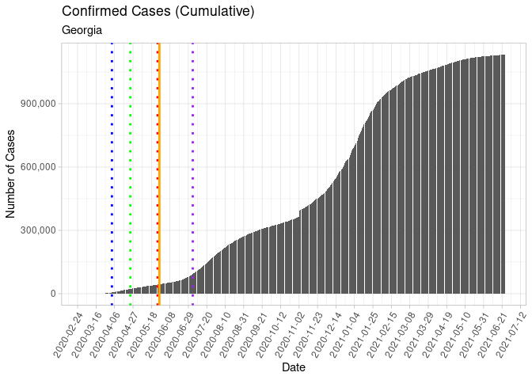<!-- -->

## Hawaii

``` r
# call the state_reopen function for individual states
HI_cases <- plot_state_reopening("Hawaii","2020-03-25", "2020-05-07")
HI_cases_log <- plot_state_reopening_log("Hawaii","2020-03-25", "2020-05-07")
HI_deaths <- plot_state_deaths_reopening("Hawaii","2020-03-25", "2020-05-07")
HI_deaths_log <- plot_state_deaths_reopening_log("Hawaii","2020-03-25", "2020-05-07")

ggarrange(HI_cases, HI_cases_log, HI_deaths, HI_deaths_log,
                    ncol = 2, nrow = 2)
```

<!-- -->

## Idaho

``` r
# call the state_reopen function for individual states

ID_cases <- plot_state_reopening("Idaho","2020-03-25", "2020-04-30")
ID_cases_log <- plot_state_reopening_log("Idaho","2020-03-25", "2020-04-30")
ID_deaths <- plot_state_deaths_reopening("Idaho","2020-03-25", "2020-04-30")
ID_deaths_log <- plot_state_deaths_reopening_log("Idaho","2020-03-25", "2020-04-30")

ggarrange(ID_cases, ID_cases_log, ID_deaths, ID_deaths_log,
                    ncol = 2, nrow = 2)
```

<!-- -->

## Illinois

``` r
# call the state_reopen function for individual states
IL_cases <- plot_state_reopening("Illinois","2020-03-21", "2020-05-29")
IL_cases_log <- plot_state_reopening_log("Illinois","2020-03-21", "2020-05-29")
IL_deaths <- plot_state_deaths_reopening("Illinois","2020-03-21", "2020-05-29")
IL_deaths_log <- plot_state_deaths_reopening_log("Illinois","2020-03-21", "2020-05-29")

ggarrange(IL_cases, IL_cases_log, IL_deaths, IL_deaths_log,
                    ncol = 2, nrow = 2)
```

<!-- -->

## Indiana

``` r
# call the state_reopen function for individual states
IN_cases <- plot_state_reopening("Indiana","2020-03-24", "2020-05-04")
IN_cases_log <- plot_state_reopening_log("Indiana","2020-03-24", "2020-05-04")
IN_deaths <- plot_state_deaths_reopening("Indiana","2020-03-24", "2020-05-04")
IN_deaths_log <- plot_state_deaths_reopening_log("Indiana","2020-03-24", "2020-05-04")

ggarrange(IN_cases, IN_cases_log, IN_deaths, IN_deaths_log,
                    ncol = 2, nrow = 2)
```

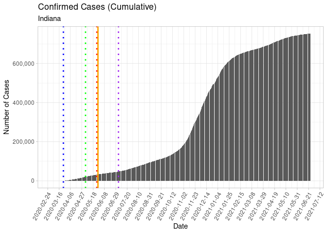<!-- -->

## Iowa

``` r
# call the state_reopen function for individual states

IA_cases <- plot_state_reopening("Iowa", , "2020-05-01")
IA_cases_log <- plot_state_reopening_log("Iowa", , "2020-05-01")
IA_deaths <- plot_state_deaths_reopening("Iowa", , "2020-05-01")
IA_deaths_log <- plot_state_deaths_reopening_log("Iowa", , "2020-05-01")

ggarrange(IA_cases, IA_cases_log, IA_deaths, IA_deaths_log,
                    ncol = 2, nrow = 2)
```

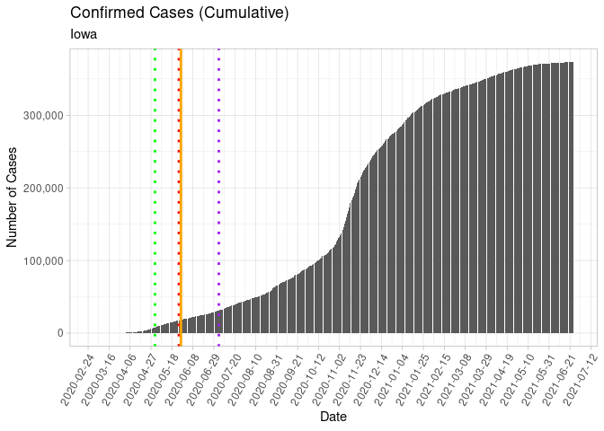<!-- -->

## Kansas

``` r
# call the state_reopen function for individual states

KS_cases <- plot_state_reopening("Kansas", "2020-03-30", "2020-05-04")
KS_cases_log <- plot_state_reopening_log("Kansas", "2020-03-30", "2020-05-04")
KS_deaths <- plot_state_deaths_reopening("Kansas", "2020-03-30", "2020-05-04")
KS_deaths_log <- plot_state_deaths_reopening_log("Kansas", "2020-03-30", "2020-05-04")

ggarrange(KS_cases, KS_cases_log, KS_deaths, KS_deaths_log,
                    ncol = 2, nrow = 2)
```

<!-- -->

## Kentucky

``` r
# call the state_reopen function for individual states

KY_cases <- plot_state_reopening("Kentucky", "2020-03-26", "2020-05-20")
KY_cases_log <- plot_state_reopening_log("Kentucky", "2020-03-26", "2020-05-20")
KY_deaths <- plot_state_deaths_reopening("Kentucky", "2020-03-26", "2020-05-20")
KY_deaths_log <- plot_state_deaths_reopening_log("Kentucky", "2020-03-26", "2020-05-20")

ggarrange(KY_cases, KY_cases_log, KY_deaths, KY_deaths_log,
                    ncol = 2, nrow = 2)
```

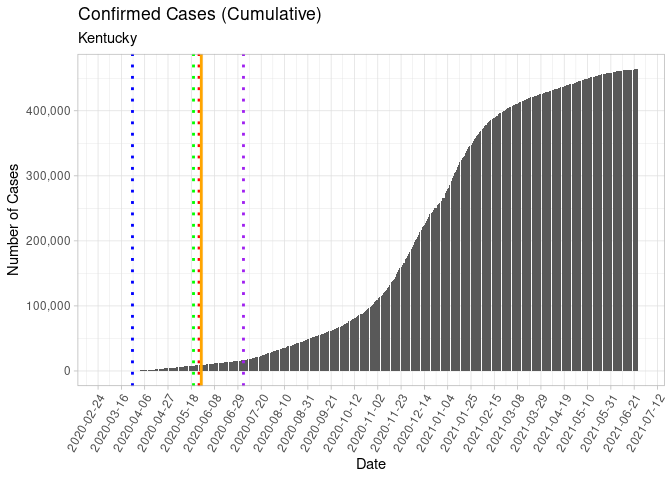<!-- -->

## Louisiana

``` r
# call the state_reopen function for individual states

LA_cases <- plot_state_reopening("Louisiana", "2020-03-23", "2020-05-15")
LA_cases_log <- plot_state_reopening_log("Louisiana", "2020-03-23", "2020-05-15")
LA_deaths <- plot_state_deaths_reopening("Louisiana", "2020-03-23", "2020-05-15")
LA_deaths_log <- plot_state_deaths_reopening_log("Louisiana", "2020-03-23", "2020-05-15")

ggarrange(LA_cases, LA_cases_log, LA_deaths, LA_deaths_log,
                    ncol = 2, nrow = 2)
```

<!-- -->

## Maine

``` r
# call the state_reopen function for individual states
ME_cases <- plot_state_reopening("Maine", "2020-04-02", "2020-05-31")
ME_cases_log <- plot_state_reopening_log("Maine", "2020-04-02", "2020-05-31")
ME_deaths <- plot_state_deaths_reopening("Maine", "2020-04-02", "2020-05-31")
ME_deaths_log <- plot_state_deaths_reopening_log("Maine", "2020-04-02", "2020-05-31")

ggarrange(ME_cases, ME_cases_log, ME_deaths, ME_deaths_log,
                    ncol = 2, nrow = 2)
```

<!-- -->

## Maryland

``` r
# call the state_reopen function for individual states

MD_cases <- plot_state_reopening("Maryland", "2020-03-30", "2020-05-15")
MD_cases_log <- plot_state_reopening_log("Maryland", "2020-03-30", "2020-05-15")
MD_deaths <- plot_state_deaths_reopening("Maryland", "2020-03-30", "2020-05-15")
MD_deaths_log <- plot_state_deaths_reopening_log("Maryland", "2020-03-30", "2020-05-15")

ggarrange(MD_cases, MD_cases_log, MD_deaths, MD_deaths_log,
                    ncol = 2, nrow = 2)
```

<!-- -->

## Massachusetts

``` r
# call the state_reopen function for individual states
MA_cases <- plot_state_reopening("Massachusetts", "2020-03-24", "2020-05-18")
MA_cases_log <- plot_state_reopening_log("Massachusetts", "2020-03-24", "2020-05-18")
MA_deaths <- plot_state_deaths_reopening("Massachusetts", "2020-03-24", "2020-05-18")
MA_deaths_log <- plot_state_deaths_reopening_log("Massachusetts", "2020-03-24", "2020-05-18")

ggarrange(MA_cases, MA_cases_log, MA_deaths, MA_deaths_log,
                    ncol = 2, nrow = 2)
```

<!-- -->

## Michigan

``` r
# call the state_reopen function for individual states
MI_cases <- plot_state_reopening("Michigan", "2020-03-24", "2020-05-11")
MI_cases_log <- plot_state_reopening_log("Michigan", "2020-03-24", "2020-05-11")
MI_deaths <- plot_state_deaths_reopening("Michigan", "2020-03-24", "2020-05-11")
MI_deaths_log <- plot_state_deaths_reopening_log("Michigan", "2020-03-24", "2020-05-11")

ggarrange(MI_cases, MI_cases_log, MI_deaths, MI_deaths_log,
                    ncol = 2, nrow = 2)
```

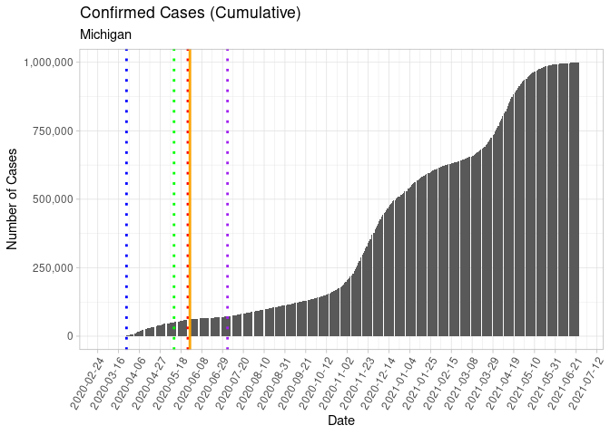<!-- -->

## Minnesota

``` r
# call the state_reopen function for individual states

MN_cases <- plot_state_reopening("Minnesota", "2020-03-27", "2020-04-27")
MN_cases_log <- plot_state_reopening_log("Minnesota", "2020-03-27", "2020-04-27")
MN_deaths <- plot_state_deaths_reopening("Minnesota", "2020-03-27", "2020-04-27")
MN_deaths_log <- plot_state_deaths_reopening_log("Minnesota", "2020-03-27", "2020-04-27")

ggarrange(MN_cases, MN_cases_log, MN_deaths, MN_deaths_log,
                    ncol = 2, nrow = 2)
```

<!-- -->

## Mississippi

``` r
# call the state_reopen function for individual states

MS_cases <- plot_state_reopening("Mississippi", "2020-04-03", "2020-04-27")
MS_cases_log <- plot_state_reopening_log("Mississippi", "2020-04-03", "2020-04-27")
MS_deaths <- plot_state_deaths_reopening("Mississippi", "2020-04-03", "2020-04-27")
MS_deaths_log <- plot_state_deaths_reopening_log("Mississippi", "2020-04-03", "2020-04-27")

ggarrange(MS_cases, MS_cases_log, MS_deaths, MS_deaths_log,
                    ncol = 2, nrow = 2)
```

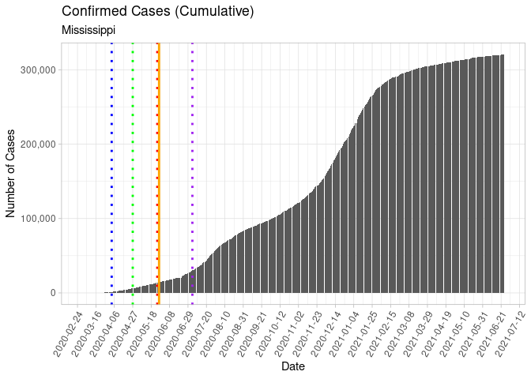<!-- -->

## Missouri

``` r
# call the state_reopen function for individual states

MO_cases <- plot_state_reopening("Missouri", "2020-04-06", "2020-05-03")
MO_cases_log <- plot_state_reopening_log("Missouri", "2020-04-06", "2020-05-03")
MO_deaths <- plot_state_deaths_reopening("Missouri", "2020-04-06", "2020-05-03")
MO_deaths_log <- plot_state_deaths_reopening_log("Missouri", "2020-04-06", "2020-05-03")

ggarrange(MO_cases, MO_cases_log, MO_deaths, MO_deaths_log,
                    ncol = 2, nrow = 2)
```

<!-- -->

## Montana

``` r
# call the state_reopen function for individual states

MT_cases <- plot_state_reopening("Montana", "2020-03-28", "2020-04-26")
MT_cases_log <- plot_state_reopening_log("Montana", "2020-03-28", "2020-04-26")
MT_deaths <- plot_state_deaths_reopening("Montana", "2020-03-28", "2020-04-26")
MT_deaths_log <- plot_state_deaths_reopening_log("Montana", "2020-03-28", "2020-04-26")

ggarrange(MT_cases, MT_cases_log, MT_deaths, MT_deaths_log,
                    ncol = 2, nrow = 2)
```

<!-- -->

## Nebraska

``` r
# call the state_reopen function for individual states

NE_cases <- plot_state_reopening("Nebraska", , "2020-05-04")
NE_cases_log <- plot_state_reopening_log("Nebraska", , "2020-05-04")
NE_deaths <- plot_state_deaths_reopening("Nebraska", , "2020-05-04")
NE_deaths_log <- plot_state_deaths_reopening_log("Nebraska", , "2020-05-04")

ggarrange(NE_cases, NE_cases_log, NE_deaths, NE_deaths_log,
                    ncol = 2, nrow = 2)
```

<!-- -->

## Nevada

``` r
# call the state_reopen function for individual states

NV_cases <- plot_state_reopening("Nevada", "2020-04-01", "2020-05-09")
NV_cases_log <- plot_state_reopening_log("Nevada", "2020-04-01", "2020-05-09")
NV_deaths <- plot_state_deaths_reopening("Nevada", "2020-04-01", "2020-05-09")
NV_deaths_log <- plot_state_deaths_reopening_log("Nevada", "2020-04-01", "2020-05-09")

ggarrange(NV_cases, NV_cases_log, NV_deaths, NV_deaths_log,
                    ncol = 2, nrow = 2)
```

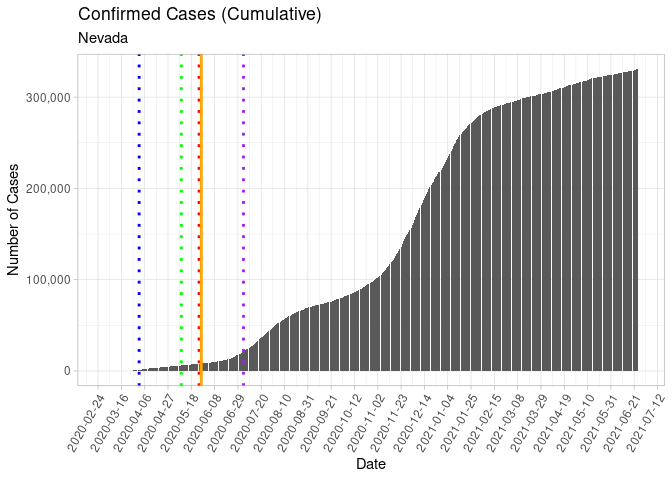<!-- -->

## New Hampshire

``` r
# call the state_reopen function for individual states

NH_cases <- plot_state_reopening("New Hampshire", "2020-03-27", "2020-05-11")
NH_cases_log <- plot_state_reopening_log("New Hampshire", "2020-03-27", "2020-05-11")
NH_deaths <- plot_state_deaths_reopening("New Hampshire", "2020-03-27", "2020-05-11")
NH_deaths_log <- plot_state_deaths_reopening_log("New Hampshire", "2020-03-27", "2020-05-11")

ggarrange(NH_cases, NH_cases_log, NH_deaths, NH_deaths_log,
                    ncol = 2, nrow = 2)
```

<!-- -->

## New Jersey

``` r
# call the state_reopen function for individual states

NJ_cases <- plot_state_reopening("New Jersey", "2020-03-21", )
NJ_cases_log <- plot_state_reopening_log("New Jersey", "2020-03-21", )
NJ_deaths <- plot_state_deaths_reopening("New Jersey", "2020-03-21", )
NJ_deaths_log <- plot_state_deaths_reopening_log("New Jersey", "2020-03-21", )

ggarrange(NJ_cases, NJ_cases_log, NJ_deaths, NJ_deaths_log,
                    ncol = 2, nrow = 2)
```

<!-- -->

## New Mexico

``` r
# call the state_reopen function for individual states
NM_cases <- plot_state_reopening("New Mexico", "2020-03-24", "2020-05-16")
NM_cases_log <- plot_state_reopening_log("New Mexico", "2020-03-24", "2020-05-16")
NM_deaths <- plot_state_deaths_reopening("New Mexico", "2020-03-24", "2020-05-16")
NM_deaths_log <- plot_state_deaths_reopening_log("New Mexico", "2020-03-24", "2020-05-16")

ggarrange(NM_cases, NM_cases_log, NM_deaths, NM_deaths_log,
                    ncol = 2, nrow = 2)
```

<!-- -->

## New York

``` r
# call the state_reopen function for individual states
NY_cases <- plot_state_reopening("New York", "2020-03-22", "2020-05-15")
NY_cases_log <- plot_state_reopening_log("New York", "2020-03-22", "2020-05-15")
NY_deaths <- plot_state_deaths_reopening("New York", "2020-03-22", "2020-05-15")
NY_deaths_log <- plot_state_deaths_reopening_log("New York", "2020-03-22", "2020-05-15")

ggarrange(NY_cases, NY_cases_log, NY_deaths, NY_deaths_log,
                    ncol = 2, nrow = 2)
```

<!-- -->

## North Carolina

``` r
# call the state_reopen function for individual states
NC_cases <- plot_state_reopening("North Carolina", "2020-03-30", "2020-05-22")
NC_cases_log <- plot_state_reopening_log("North Carolina", "2020-03-30", "2020-05-22")
NC_deaths <- plot_state_deaths_reopening("North Carolina", "2020-03-30", "2020-05-22")
NC_deaths_log <- plot_state_deaths_reopening_log("North Carolina", "2020-03-30", "2020-05-22")

ggarrange(NC_cases, NC_cases_log, NC_deaths, NC_deaths_log,
                    ncol = 2, nrow = 2)
```

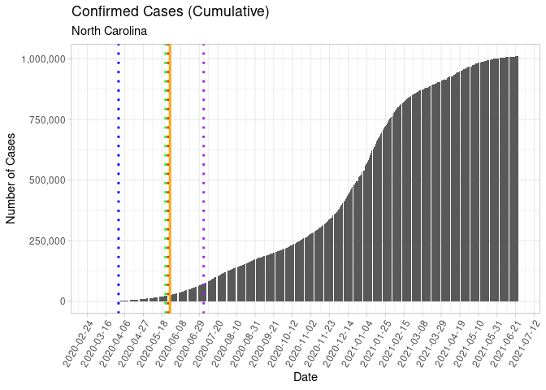<!-- -->

## North Dakota

``` r
# call the state_reopen function for individual states
ND_cases <- plot_state_reopening("North Dakota", , "2020-05-01")
ND_cases_log <- plot_state_reopening_log("North Dakota", , "2020-05-01")
ND_deaths <- plot_state_deaths_reopening("North Dakota", , "2020-05-01")
ND_deaths_log <- plot_state_deaths_reopening_log("North Dakota", , "2020-05-01")

ggarrange(ND_cases, ND_cases_log, ND_deaths, ND_deaths_log,
                    ncol = 2, nrow = 2)
```

<!-- -->

## Ohio

``` r
# call the state_reopen function for individual states

OH_cases <- plot_state_reopening("Ohio", "2020-03-23", "2020-05-29")
OH_cases_log <- plot_state_reopening_log("Ohio", "2020-03-23", "2020-05-29")
OH_deaths <- plot_state_deaths_reopening("Ohio", "2020-03-23", "2020-05-29")
OH_deaths_log <- plot_state_deaths_reopening_log("Ohio", "2020-03-23", "2020-05-29")

ggarrange(OH_cases, OH_cases_log, OH_deaths, OH_deaths_log,
                    ncol = 2, nrow = 2)
```

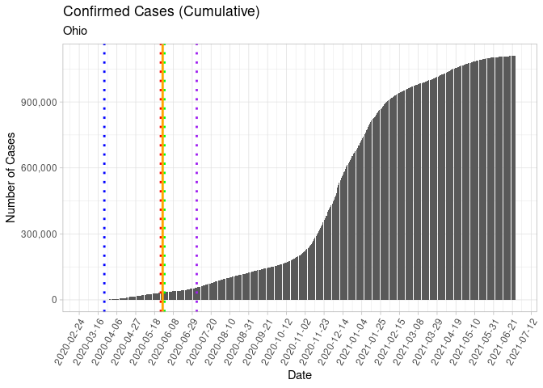<!-- -->

## Oklahoma

``` r
# call the state_reopen function for individual states

OK_cases <- plot_state_reopening("Oklahoma", "2020-04-06", "2020-04-24")
OK_cases_log <- plot_state_reopening_log("Oklahoma", "2020-04-06", "2020-04-24")
OK_deaths <- plot_state_deaths_reopening("Oklahoma", "2020-04-06", "2020-04-24")
OK_deaths_log <- plot_state_deaths_reopening_log("Oklahoma", "2020-04-06", "2020-04-24")

ggarrange(OK_cases, OK_cases_log, OK_deaths, OK_deaths_log,
                    ncol = 2, nrow = 2)
```

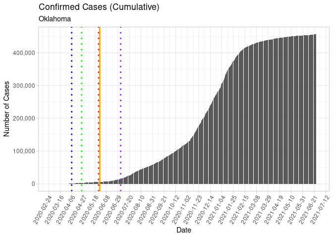<!-- -->

## Oregon

``` r
# call the state_reopen function for individual states

OR_cases <- plot_state_reopening("Oregon", "2020-03-23", "2020-05-15")
OR_cases_log <- plot_state_reopening_log("Oregon", "2020-03-23", "2020-05-15")
OR_deaths <- plot_state_deaths_reopening("Oregon", "2020-03-23", "2020-05-15")
OR_deaths_log <- plot_state_deaths_reopening_log("Oregon", "2020-03-23", "2020-05-15")

ggarrange(OR_cases, OR_cases_log, OR_deaths, OR_deaths_log,
                    ncol = 2, nrow = 2)
```

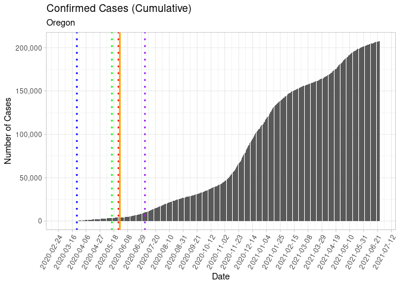<!-- -->

## Pennsylvania

``` r
# call the state_reopen function for individual states

PA_cases <- plot_state_reopening("Pennsylvania", "2020-04-01", "2020-06-04")
PA_cases_log <- plot_state_reopening_log("Pennsylvania", "2020-04-01", "2020-06-04")
PA_deaths <- plot_state_deaths_reopening("Pennsylvania", "2020-04-01", "2020-06-04")
PA_deaths_log <- plot_state_deaths_reopening_log("Pennsylvania", "2020-04-01", "2020-06-04")

ggarrange(PA_cases, PA_cases_log, PA_deaths, PA_deaths_log,
                    ncol = 2, nrow = 2)
```

<!-- -->

## Rhode Island

``` r
# call the state_reopen function for individual states

RI_cases <- plot_state_reopening("Rhode Island", "2020-03-28", "2020-05-08")
RI_cases_log <- plot_state_reopening_log("Rhode Island", "2020-03-28", "2020-05-08")
RI_deaths <- plot_state_deaths_reopening("Rhode Island", "2020-03-28", "2020-05-08")
RI_deaths_log <- plot_state_deaths_reopening_log("Rhode Island", "2020-03-28", "2020-05-08")

ggarrange(RI_cases, RI_cases_log, RI_deaths, RI_deaths_log,
                    ncol = 2, nrow = 2)
```

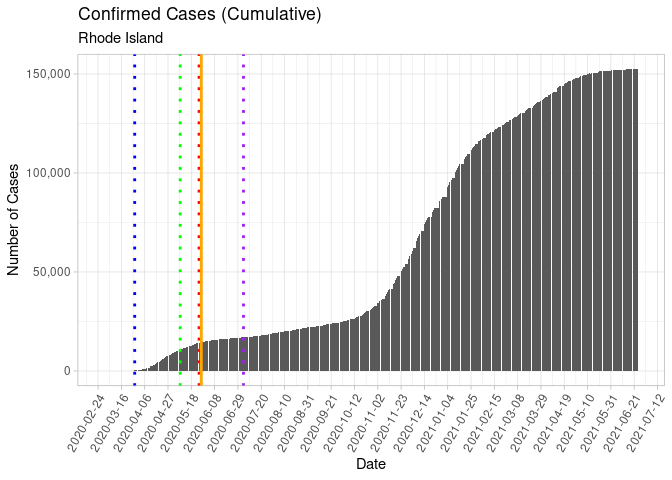<!-- -->

## South Carolina

``` r
# call the state_reopen function for individual states
SC_cases <- plot_state_reopening("South Carolina", "2020-04-07", "2020-05-04")
SC_cases_log <- plot_state_reopening_log("South Carolina", "2020-04-07", "2020-05-04")
SC_deaths <- plot_state_deaths_reopening("South Carolina", "2020-04-07", "2020-05-04")
SC_deaths_log <- plot_state_deaths_reopening_log("South Carolina", "2020-04-07", "2020-05-04")

ggarrange(SC_cases, SC_cases_log, SC_deaths, SC_deaths_log,
                    ncol = 2, nrow = 2)
```

<!-- -->

## South Dakota

``` r
# call the state_reopen function for individual states

SD_cases <- plot_state_reopening("South Dakota", , )
SD_cases_log <- plot_state_reopening_log("South Dakota", , )
SD_deaths <- plot_state_deaths_reopening("South Dakota", , )
SD_deaths_log <- plot_state_deaths_reopening_log("South Dakota", , )

ggarrange(SD_cases, SD_cases_log, SD_deaths, SD_deaths_log,
                    ncol = 2, nrow = 2)
```

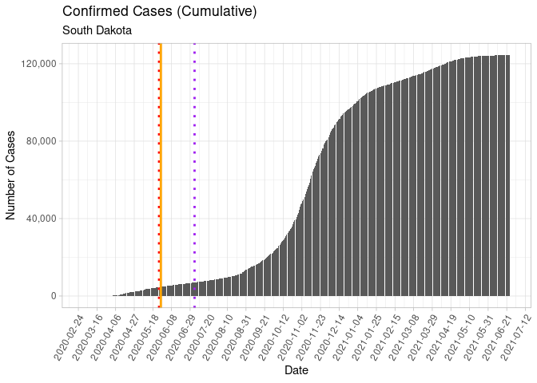<!-- -->

## Tennessee

``` r
# call the state_reopen function for individual states

TN_cases <- plot_state_reopening("Tennessee", "2020-03-31", "2020-04-24")
TN_cases_log <- plot_state_reopening_log("Tennessee", "2020-03-31", "2020-04-24")
TN_deaths <- plot_state_deaths_reopening("Tennessee", "2020-03-31", "2020-04-24")
TN_deaths_log <- plot_state_deaths_reopening_log("Tennessee", "2020-03-31", "2020-04-24")

ggarrange(TN_cases, TN_cases_log, TN_deaths, TN_deaths_log,
                    ncol = 2, nrow = 2)
```

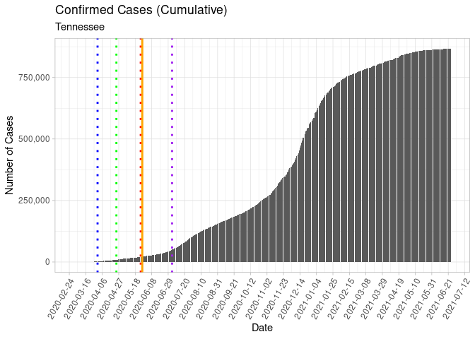<!-- -->

## Texas

``` r
# call the state_reopen function for individual states

TX_cases <- plot_state_reopening("Texas", "2020-04-02", "2020-04-30")
TX_cases_log <- plot_state_reopening_log("Texas", "2020-04-02", "2020-04-30")
TX_deaths <- plot_state_deaths_reopening("Texas", "2020-04-02", "2020-04-30")
TX_deaths_log <- plot_state_deaths_reopening_log("Texas", "2020-04-02", "2020-04-30")

ggarrange(TX_cases, TX_cases_log, TX_deaths, TX_deaths_log,
                    ncol = 2, nrow = 2)
```

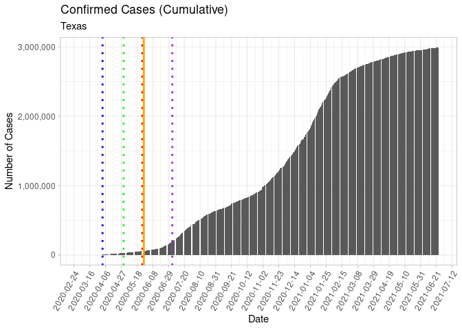<!-- -->

## Utah

``` r
# call the state_reopen function for individual states
UT_cases <- plot_state_reopening("Utah", "2020-04-01", "2020-05-01")
UT_cases_log <- plot_state_reopening_log("Utah", "2020-04-01", "2020-05-01")
UT_deaths <- plot_state_deaths_reopening("Utah", "2020-04-01", "2020-05-01")
UT_deaths_log <- plot_state_deaths_reopening_log("Utah", "2020-04-01", "2020-05-01")

ggarrange(UT_cases, UT_cases_log, UT_deaths, UT_deaths_log,
                    ncol = 2, nrow = 2)
```

<!-- -->

## Vermont

``` r
# call the state_reopen function for individual states

VT_cases <- plot_state_reopening("Vermont", "2020-03-25", "2020-05-15")
VT_cases_log <- plot_state_reopening_log("Vermont", "2020-03-25", "2020-05-15")
VT_deaths <- plot_state_deaths_reopening("Vermont", "2020-03-25", "2020-05-15")
VT_deaths_log <- plot_state_deaths_reopening_log("Vermont", "2020-03-25", "2020-05-15")

ggarrange(VT_cases, VT_cases_log, VT_deaths, VT_deaths_log,
                    ncol = 2, nrow = 2)
```

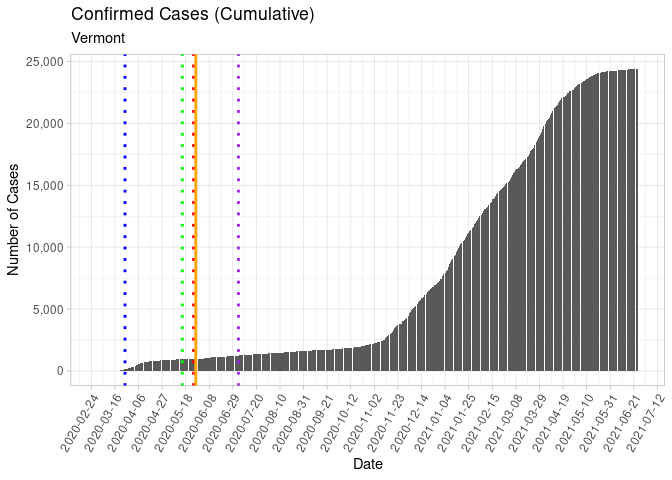<!-- -->

## Virginia

``` r
# call the state_reopen function for individual states

VA_cases <- plot_state_reopening("Virginia", "2020-03-30", "2020-05-15")
VA_cases_log <- plot_state_reopening_log("Virginia", "2020-03-30", "2020-05-15")
VA_deaths <- plot_state_deaths_reopening("Virginia", "2020-03-30", "2020-05-15")
VA_deaths_log <- plot_state_deaths_reopening_log("Virginia", "2020-03-30", "2020-05-15")

ggarrange(VA_cases, VA_cases_log, VA_deaths, VA_deaths_log,
                    ncol = 2, nrow = 2)
```

<!-- -->

## Washington

``` r
# call the state_reopen function for individual states
WA_cases <- plot_state_reopening("Washington", "2020-03-23", "2020-05-11")
WA_cases_log <- plot_state_reopening_log("Washington", "2020-03-23", "2020-05-11")
WA_deaths <- plot_state_deaths_reopening("Washington", "2020-03-23", "2020-05-11")
WA_deaths_log <- plot_state_deaths_reopening_log("Washington", "2020-03-23", "2020-05-11")

ggarrange(WA_cases, WA_cases_log, WA_deaths, WA_deaths_log,
                    ncol = 2, nrow = 2)
```

<!-- -->

## West Virginia

``` r
# call the state_reopen function for individual states
WV_cases <- plot_state_reopening("West Virginia", "2020-03-24", "2020-05-04")
WV_cases_log <- plot_state_reopening_log("West Virginia", "2020-03-24", "2020-05-04")
WV_deaths <- plot_state_deaths_reopening("West Virginia", "2020-03-24", "2020-05-04")
WV_deaths_log <- plot_state_deaths_reopening_log("West Virginia", "2020-03-24", "2020-05-04")

ggarrange(WV_cases, WV_cases_log, WV_deaths, WV_deaths_log,
                    ncol = 2, nrow = 2)
```

<!-- -->

## Wisconsin

``` r
# call the state_reopen function for individual states
WI_cases <- plot_state_reopening("Wisconsin", "2020-03-25", "2020-05-13")
WI_cases_log <- plot_state_reopening_log("Wisconsin", "2020-03-25", "2020-05-13")
WI_deaths <- plot_state_deaths_reopening("Wisconsin", "2020-03-25", "2020-05-13")
WI_deaths_log <- plot_state_deaths_reopening_log("Wisconsin", "2020-03-25", "2020-05-13")

ggarrange(WI_cases, WI_cases_log, WI_deaths, WI_deaths_log,
                    ncol = 2, nrow = 2)
```

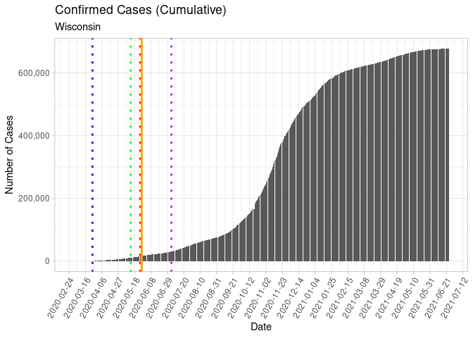<!-- -->

NOTE: Wisconsin stay-at-home order struck down on May 13.

## Wyoming

``` r
# call the state_reopen function for individual states
WY_cases <- plot_state_reopening("Wyoming", "2020-03-28", "2020-05-01")
WY_cases_log <- plot_state_reopening_log("Wyoming", "2020-03-28", "2020-05-01")
WY_deaths <- plot_state_deaths_reopening("Wyoming", "2020-03-28", "2020-05-01")
WY_deaths_log <- plot_state_deaths_reopening_log("Wyoming", "2020-03-28", "2020-05-01")

ggarrange(WY_cases, WY_cases_log, WY_deaths, WY_deaths_log,
                    ncol = 2, nrow = 2)
```

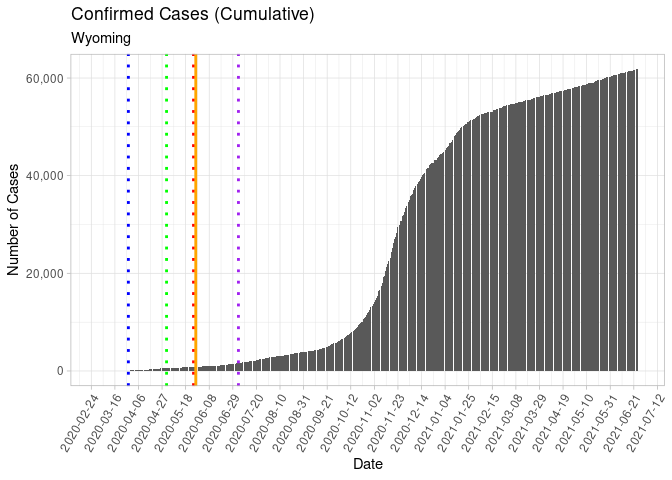<!-- -->

<!-- ```{r} -->

<!-- # plot select states (initially selecting some of the states where people are protesting, will refine with more precise selection) -->

<!-- states = c("Florida", "Georgia", "Michigan", "California", "Illinois", "Pennsylvania", "Colorado") -->

<!-- states <- by_state %>% -->

<!--   select(date, all_of(states)) %>% -->

<!--   gather(key = "State", value = "value", -date) -->

<!-- ggplot(states, aes(x = date, y = value)) +  -->

<!--   geom_line(stat= "identity", aes(color = State)) +  -->

<!--   scale_x_date(date_breaks = "1 week") + -->

<!--   ylab("Number of Cases") +  -->

<!--   scale_y_continuous(labels = comma) + -->

<!--   geom_vline(xintercept = as.Date("2020-05-04"), linetype="dotted",  -->

<!--                 color = "blue", size=1.5) + -->

<!--   theme_minimal() +  -->

<!--   theme(axis.text.x=element_text(angle=60, hjust=1))  -->

<!-- #+ facet_wrap(~State) -->

<!-- ``` -->

Last Updated:

    ## [1] "2020-06-05 20:57:18 EDT"

## REFERENCES

  - <a href="https://www.nytimes.com/interactive/2020/us/coronavirus-stay-at-home-order.html">NY
    Times: See Which States and Cities Have Told Residents to Stay at
    Home</a>
  - <a href="https://www.nytimes.com/interactive/2020/us/states-reopen-map-coronavirus.html">See
    Which States Are Reopening and Which Are Still Shut Down</a>

<a href="https://github.com/marymlucas">My Github</a>

### To Do:

  - Refresh data
  - Add population info
