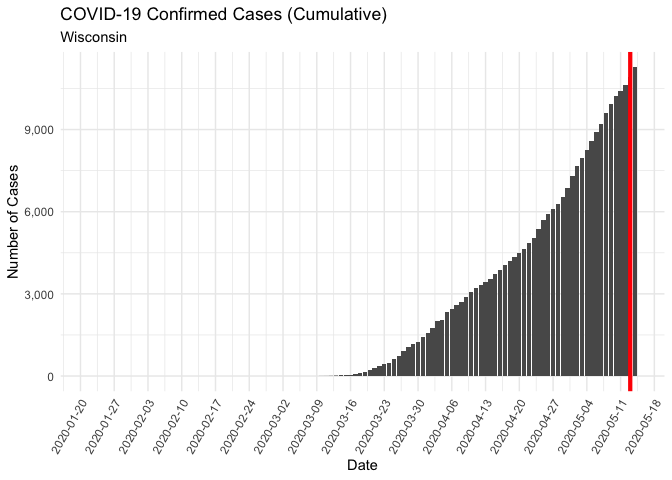

COVID-19 state Reopenings
================

The ultimate goal here it to see if there’s a noticeable impact on
COVID-19 cases as different states start to reopen.

``` r
# Load libraries
library(tidyverse)
```

    ## ── Attaching packages ─────────────────────────────────────────────────────────────────────── tidyverse 1.3.0 ──

    ## ✓ ggplot2 3.3.0     ✓ purrr   0.3.4
    ## ✓ tibble  3.0.1     ✓ dplyr   0.8.5
    ## ✓ tidyr   1.0.2     ✓ stringr 1.4.0
    ## ✓ readr   1.3.1     ✓ forcats 0.5.0

    ## ── Conflicts ────────────────────────────────────────────────────────────────────────── tidyverse_conflicts() ──
    ## x dplyr::filter() masks stats::filter()
    ## x dplyr::lag()    masks stats::lag()

``` r
library(lubridate)
```

    ## 
    ## Attaching package: 'lubridate'

    ## The following objects are masked from 'package:dplyr':
    ## 
    ##     intersect, setdiff, union

    ## The following objects are masked from 'package:base':
    ## 
    ##     date, intersect, setdiff, union

``` r
library(data.table) # need this for the "%like%"function
```

    ## 
    ## Attaching package: 'data.table'

    ## The following objects are masked from 'package:lubridate':
    ## 
    ##     hour, isoweek, mday, minute, month, quarter, second, wday, week,
    ##     yday, year

    ## The following objects are masked from 'package:dplyr':
    ## 
    ##     between, first, last

    ## The following object is masked from 'package:purrr':
    ## 
    ##     transpose

``` r
# Load John Hopkins case data
jhu_latest_raw <- read.csv("https://raw.githubusercontent.com/CSSEGISandData/COVID-19/master/csse_covid_19_data/csse_covid_19_time_series/time_series_covid19_confirmed_US.csv")
```

``` r
# do some data cleaning
jhu_latest <- jhu_latest_raw 
jhu_latest <- jhu_latest %>% filter(iso3 == "USA") %>%
 select(-UID, -iso2, -iso3, -code3, -FIPS, -Admin2, -Country_Region, -Lat, -Long_, -Combined_Key) 

by_state <- jhu_latest %>% 
  group_by(Province_State) %>%
  summarise_all(funs(sum(.))) %>%
  column_to_rownames(var = "Province_State") %>%
  t() %>%
  as.data.frame() %>%
  rownames_to_column() %>%
  mutate(date = str_sub(rowname, 2)) %>%
  select(date, everything()) %>%
  select(-rowname) %>%
  mutate(date = mdy(date))
```

``` r
# plot select states (initially selecting some of the states where people are protesting, will refine with more precise selection)
states = c("Florida", "Georgia", "Michigan", "California", "Illinois", "Pennsylvania")
df <- by_state %>%
  select(date, all_of(states)) %>%
  gather(key = "State", value = "value", -date)
#tail(df)


ggplot(df, aes(x = date, y = value)) + 
  geom_line(aes(color = State)) + 
  scale_x_date(date_breaks = "2 weeks") +
  ylab("Number of Cases") + 
  theme_minimal() + 
  theme(axis.text.x=element_text(angle=60, hjust=1))
```

<!-- -->

Last Updated:

    ## [1] "2020-05-01 14:45:54 EDT"

To Do: - Refresh states - Plot log scale
